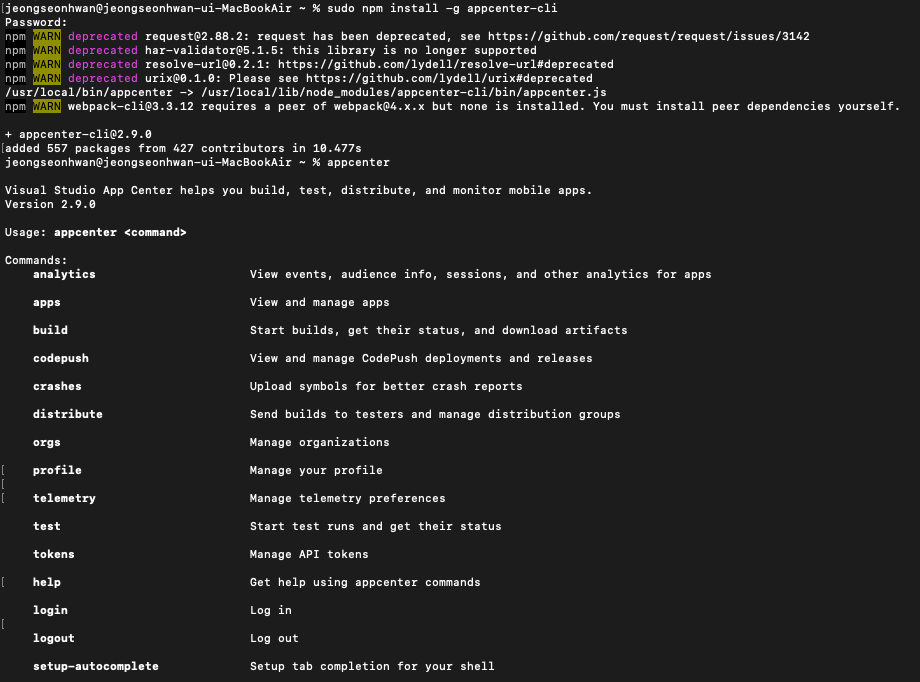
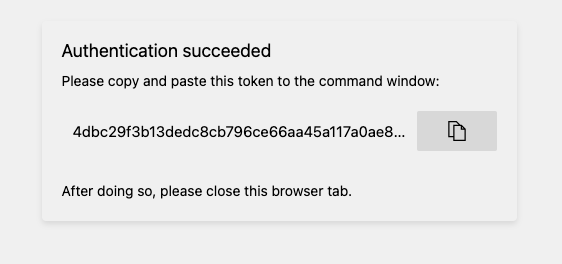
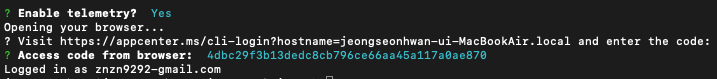

## CodePush Guide

<br>

### appcenter Sign Up

<hr>

### appcenter Login

appcenter 설치
```
$ sudo npm install -g appcenter-cli
$ appcenter
```



appcenter 로그인 및 Access Code 발급
```
$ appcenter login
$ Enable telemetry?  Y
```

* appcenter 설치가 완료 되었다면 로그인을 시도



* `Enable telemetry?` 에서 `Y` 를 입력하면 브라우저에 Access Code를 발급 



* 발급된 Access Code를 `Access code from browser` 에 넣고 로그인 요청 
* `Logged in as [email]` 문구가 나오면 로그인 완료

<hr>

### appcenter Create Project
```
$ appcenter apps create -d Code-Push-Test-Android -o Android -p React-Native
$ appcenter apps create -d Code-Push-Test-IOS -o iOS -p React-Native
```

