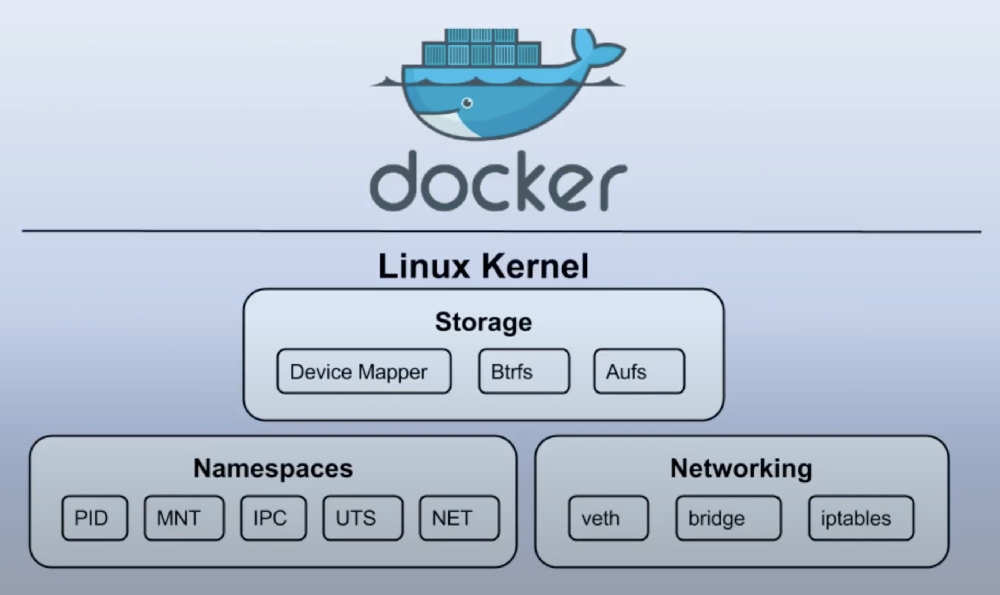

## Docker Container

 

### 컨테이너를 사용하는 이유 ?
IT 시스템화 해야할 서비스는 점점 늘어나고 애플리케이션 플랫폼은 대규모화 되는 등 여러 요소로 인해 변화 되어 가고 있다.
과거의 엔터프라이즈 시장에서는 대용량 Bear Metal에 여러개에 애플리케이션을 운영하는 구조로 사용해왔다.

점점 하드웨어의 값은 저렴해지고 성능은 좋아지면서 Bear Metal 시스템에 **하이퍼바이저(Hypervisor)** 라는 것을 만들었다.
하이퍼바이저에 소프트웨어적인 기술을 가지고 가상컴퓨터(Virtual Machine) 에다가 필요한 애플리케이션을 올려서 사용 해왔다.
이것이 가상화 플랫폼이다.

이 가상화 플랫폼에서 또 시대적으로 변화가 되었다. 애플리케이션을 운영할때 클리어언트 요구에 따라 **스케일 아웃(Scale out) 또는 스케일 업(Scale up)** 하여 사용한다.
플랫폼 규모를 자유롭게 확대, 축소 할 수 있는 서비스를 필요로 했으며, 서비스 중단없는 애플리케이션을 운영해야 하는 환경을 대해서 가상환경에서는 어려움이 있다.

기존 동일한 Bear Metal 시스템 운영체제 위에 **컨테이너 엔진(Container Engine)** 을 설치하여 사용 하는 것이다.
Docker는 이 컨테이너 엔진 중 하나이다. **도커 컨테이너(Docker Container)** 엔진을 올리는 것이며 컨테이너 플랫폼으로 애플리케이션을 운영 하는 것이다.

컨테이너로 운영되는 애플리케이션은 용량이 적다. 실제 애플리케이션을 구동하기 위한 최소 환경으로 구성 되어있기 떄문에 아주 작은 용량으로 운영 된다.
적은 용량으로 프로그램이 실행 되다 보니 확장성이 굉장히 좋고 배포가 쉽기 때문에 **이 시대는 컨테이너를 요구하는 시대 이다.**

### 도커를 리눅스에서 실행하는 이유 ?
컨테이너는 **리눅스 커널 기능** 기반으로 만들어졌기 때문이다.

* chroot - 독립된 공간 형성 
* namespace - isolate 기능 지원
* cgroup - 필요한만큼 HW 지원

> 리눅스 커널에 있는 Storage, Namespaces, Networking 을 도커 플랫폼에서 사용 할 수 있도록
지원 해주는 것이 컨테이너 엔진이다.

Windows 또는 Mac 환경에서는 컨테이너를 구동 시킬수는 있지만 **Hypervisor를 활성화 하여 리눅스 커널 기능을 서포팅** 해줘야 한다.

### 도커를 사용하는 이유?
개발자가 만든 프로그램을 그대로 어디서든 사용할 수 있고 확장/축소 하기에 편리하며 MSA(MicroService Architecture)나 DevOps 환경에서 아주 적합하다.

