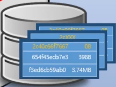

## Docker Image

<br>

컨테이너는 하나의 Application 프로세스 <br>
컨테이너의 특징은 Application이 완전하게 독립된 공간으로 분리되서 운영된다.
CPU, Memory, Network등 하드웨어 리소스를 따로따로 가지며 컨테이너 user 계정, hostname까지도 독립 되어 있어 A 컨테이너가 운영하는데에 있어 B 컨테이너에 영향을 주지 않는다.

### 컨테이너는 어떻게 동작할까?
리눅스 커널을 가지고 있는 OS 시스템 위에 Docker를 설치해 Docker 데몬을 실행하는 형태를 
**Docker HOST**라고 한다.

> 이말은 Docker가 컨테이너를 실행할 수 있는 플랫폼을 구축했다 라는 의미

### 컨테이너와 컨테이너 이미지


* nodeJS 로 컨테이너 설비를 갖춘다. [Base Image Layer]
* 소스코드 app.js 라는 물건을 담는다. [Source Image Layer]
* app.js 가 동작하기 위해 Application을 실행 되도록 한다. [run node app.js Layer]


* 시스템은 이미지를 저장할 때 UUID로 저장
* 여러개의 레이어로 구성되며 하나의 애플리케이션이 실행 될 수 있도록 도와주는 이미지들의 조합을 **컨테이너 이미지(Container Image)** 라고 한다.


* 컨테이너 이미지는 하드디스크에 파일 형태로 저장 되어 있으며 Layer별로 각각 따로 저장된다.

### 컨테이너 이미지 실행
* 컨테이너 이미지를 실행 하면 메모리에 도커 컨테이너가 애플리케이션 프로세스로 할당 된다.
* 컨테이너 이미지 디스크에 저장되어 있고 ReadOnly 성격을 가진다.


### Docker Hub
* 웹 사이트로 제공되는 Docker 이미지 허브 <br>
https://hub.docker.com/
* 도커 컨테이너를 저장 해놓고 있는 창고이고 10만여개 이상 존재한다.

* 도커 허브에 특정 이미지 찾기
```
$ docker search nginx
```

* 도커 허브에 이미지 가져오기
```
$ docker pull nginx:latest
```

