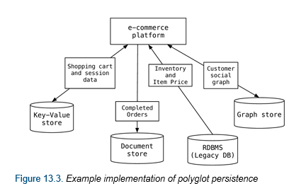

## Docker Container 만들기

<br>

한개 컨테이너는 한개 애플리케이션을 운영 관리 하고, 컨테이너 간에 서로 독립된 환경에서 실행 된다고 [Docker Container](2020-06-13.md), [Docker Image](2020-06-13.md) 여기서 설명 했다. <br>

### 폴리글랏 프로그래밍 (Polyglot Programming)
> 각각의 애플리케이션 서비스에 맞춰 컨테이너를 만든다.

* 폴리글랏(polyglot)은 여러 언어를 구사하는 것을 말한다. 즉, 폴리글랏 프로그래밍은 ‘패러다임을 달리 하는 여러 개발 언어를 자유롭게 구사하는 것’이라고 할 수 있다.

* 소프트웨어 관점으로 본다면 다양한 기술 언어(nodeJS, JAVA, Python..)를 이용해서 애플리케이션을 개발하는데 가장 적합한 언어를 선택해서 각 컨테이너 별로 플랫폼을 구축한다.



### DockerFile (도커 파일)
도커 컨테이너를 만들 수 있도록 도와주는 명령어 집합
* 쉽고, 간단, 명확한 구문을 가진 text file로 Top-Down으로 해석
* 컨테이너 이미지를 생성할 수 있는 **고유어 지시어(Instruction)를 가짐
* 대소문자 구분하지 않으나 가독성을 위해 사용함

DockerFile 문법
* `#`: comment
* `FROM`: 컨테이너의 BASE IMAGE
* `LABEL`: 컨테이너이미지에 컨테이너 정보를 저장
* `RUN`: 컨테이너 빌드를 위해 base image에서 실행할 commands
* `COPY`: 컨테이너 빌드 시 호스트의 파일을 컨테이너로 복사
* `ADD`: 컨테이너 빌드 시 호스트의 파일(tar, url포함)을 컨테이너로 복사
* `WORKDIR`: 컨테이너 빌드 시 명령이 실행될 작업 디렉토리 설정
* `ENV`: 환경변수 지정
* `USER`: 명령 및 컨테이너 실행 시 적용할 유저 설정
* `VOLUME`: 파일 또는 디렉토리를 컨테이너의 디렉토리로 마운트
* `EXPOSE`: 컨테이너 동작 시 외부에서 사용할 포트 지정
* `CMD`: 컨테이너 동작 시 자동으로 실행할 서비스나 스크립트 지정
* `ENTRYPOINT`: `CMD`와 함께 사용하면서 command 지정 시 사용

DockerFile 배포
* DockerFile 작성이 되었다면 Docker Hub에 배포하고 Docker HOST에서 사용 가능하다.

* Docker HUB 로그인
```
$ docker login
```

* DockerFile 컨테이너 배포
```
$ docker push [DockerFile]
```