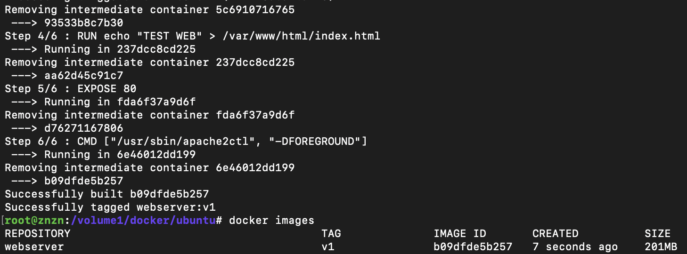
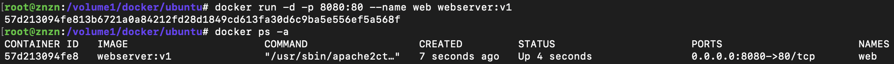
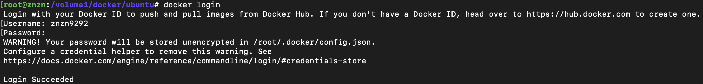
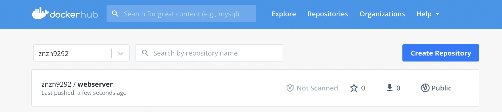

## Docker Container 만들기

<br>

한개 컨테이너는 한개 애플리케이션을 운영 관리 하고, 컨테이너 간에 서로 독립된 환경에서 실행 된다고 [Docker Container](2020-06-13.md), [Docker Image](2020-06-13.md) 여기서 설명 했다. <br>

### 폴리글랏 프로그래밍 (Polyglot Programming)
> 각각의 애플리케이션 서비스에 맞춰 컨테이너를 만든다.

* 폴리글랏(polyglot)은 여러 언어를 구사하는 것을 말한다. 즉, 폴리글랏 프로그래밍은 ‘패러다임을 달리 하는 여러 개발 언어를 자유롭게 구사하는 것’이라고 할 수 있다.

* 소프트웨어 관점으로 본다면 다양한 기술 언어(nodeJS, JAVA, Python..)를 이용해서 애플리케이션을 개발하는데 가장 적합한 언어를 선택해서 각 컨테이너 별로 플랫폼을 구축한다.


### DockerFile (도커 파일)
도커 컨테이너를 만들 수 있도록 도와주는 명령어 집합
* 쉽고, 간단, 명확한 구문을 가진 text file로 Top-Down으로 해석
* 컨테이너 이미지를 생성할 수 있는 **고유어 지시어(Instruction)**를 가짐
* 대소문자 구분하지 않으나 가독성을 위해 사용함

DockerFile 문법
* `#`: comment
* `FROM`: 컨테이너의 BASE IMAGE
* `LABEL`: 컨테이너이미지에 컨테이너 정보를 저장
* `RUN`: 컨테이너 빌드를 위해 base image에서 실행할 commands
* `COPY`: 컨테이너 빌드 시 호스트의 파일을 컨테이너로 복사
* `ADD`: 컨테이너 빌드 시 호스트의 파일(tar, url포함)을 컨테이너로 복사
* `WORKDIR`: 컨테이너 빌드 시 명령이 실행될 작업 디렉토리 설정
* `ENV`: 환경변수 지정
* `USER`: 명령 및 컨테이너 실행 시 적용할 유저 설정
* `VOLUME`: 파일 또는 디렉토리를 컨테이너의 디렉토리로 마운트
* `EXPOSE`: 컨테이너 동작 시 외부에서 사용할 포트 지정
* `CMD`: 컨테이너 동작 시 자동으로 실행할 서비스나 스크립트 지정
* `ENTRYPOINT`: `CMD`와 함께 사용하면서 command 지정 시 사용

### DockerFile 배포
* DockerFile을 작성하고 HUB에 배포하는 예제

hello.js
```javascript
const http = require('http');
const os = require('os');
console.log("Test server starting...");

var handler = function(request, response) {
    console.log("Received request from " + request.connection.remoteAddress);
    response.writeHead(200);
    response.end("Container Hostname: " + os.hostname() + "\n");
};

var www = http.createServer(handler);
www.listen(8080);
```

dockerfile
```bash
FROM ubuntu:18.04
LABEL maintainer="znzn <znzn@gmail.com>"
# install ubuntu 
RUN apt-get update \
    && apt-get install -y apache2
RUN echo "TEST WEB" > /var/www/html/index.html
EXPOSE 80
CMD ["/usr/sbin/apache2ctl", "-DFOREGROUND"]

```
* `FROM ubuntu:18.04`: ubuntu 18.04 버전 이미지를 base로 설정
* `LABEL maintainer`: 개발자 라벨 추가 
* `#`: 코멘트 추가
* `RUN`: 컨테이너 빌드 시 명령어 수행
> `RUN` 명령어를 다중 라인으로 수행 시 레이어가 그 수 만큼 생성 되므로 효율을 위해 `&&` 기호를 이용해 이미지 레이어 수를 줄일 수 있다.
* `EXPOSE 80`: 도커 컨테이너 서비스 포트
* `CMD ["/usr/sbin/apache2ctl", "-DFOREGROUND"]`: -DFOREGROUND 아규먼트를 넣고 apache2ctl를 실행

```
$ docker -t webserver:v1 .d
```
> dockerfile을 자동으로 찾음
* `-t`, `--tag`: 이름 또는 선택적 태그
* ` .`: 현재 디렉토리 안에 있는 파일을 기준으로 작업인지 알림


* 빌드 정상 확인

```
$ docker run -d -p 8080:80 --name web webserver:v1
$ docker ps -a
```

* `docker run`: 도커 컨테이너 실행
* `-d`: 백그라운드로 실행 옵션
* `-p`: 로컬 포트 8080 -> 도커 서비스포트 80 으로 포워딩
* `docker ps -a`: 현재 할당된 도커 프로세스 목록 확인

### DockerFile HUB로 PUSH
docker HUB 계정 로그인
```
$ docker login
```


docker Image Tag 변경
> HUB에 PUSH 시에 꼭 아이디가 포함되어야 한다.

```
docker tag webserver:v1 znzn9292/webserver:v1
```

docker Image PUSH
```
$ docker push znzn9292/webserver:v1
```

* 도커 이미지 PUSH 완료


