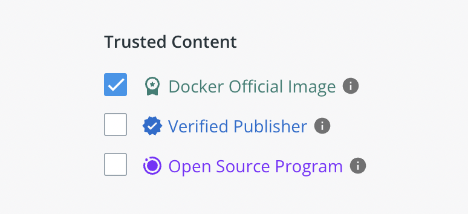
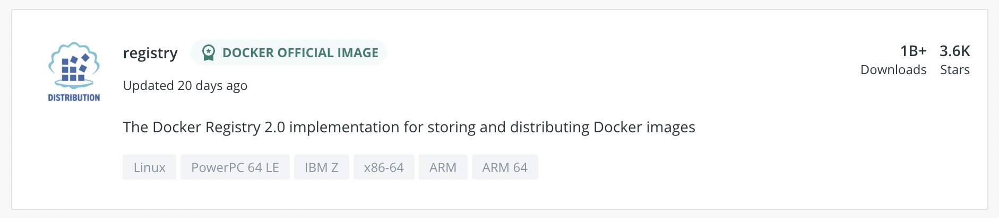
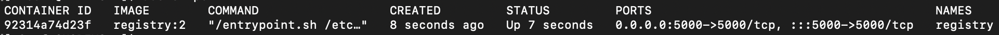
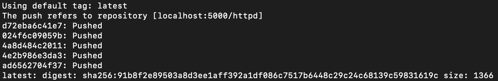
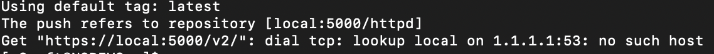
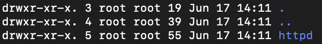

# Docker Registry

컨테이너 보관창고(Docker Registry)는 컨테이너를 모아놓은 저장소
* Registry: 컨테이너 이미지를 저장하는 저장소
* Docker Hub
* Private Registry: 사내의 컨테이너 저장소

## Private Registry 구축
도커 registry 컨테이너는 도커 이미지 저장 및 배포를 위한 컨테이너<br>
외부 네트워크가 공유되지 않는 환경에서 사용 시 적합하고, 사내 전용 컨테이너 저장소가 필요할 때 사용


### 1.Docker HUB 접속 <br>
https://hub.docker.com/
    

### 2.로그인 - Explore 메뉴 - Trusted Content
Docker Official Image 체크



### 3.registry 이미지 선택


### 4.docker 컨테이너 실행
```
$ docker run -d -p 5000:5000 --restart always --name registry registry:2
```


* `registry` 컨테이너 실행 확인

### 5. Private Registry Docker Push
```
$ docker pull httpd
```
* Push 할 예제 이미지

```
$ docker tag httpd localhost:5000/httpd
```
* Private Registry가 설치된 호스트 IP와 Port로 이미지 생성

```
$ docker push localhost:5000/httpd
```

* Provate Registry로 Push 완료
* Registry 호스트 경로(`localhost:5000`)가 없을 경우 에러 발생
 

### 6. Private Registry Image 확인
```
$ cd /var/lib/docker/volumes/4748f071ccc65d62527ab962dde028aa927d80fd68ffb729d754f7d0338a671f/_data/docker/registry/v2/repositories`
```


* 해당 경로에 httpd 이미지 확인

### 7. Private Registry Web GUI
**Docker Hub**에 정식 버전인 Official Images 로 등록되어 있는건 아니지만 해외 유저가 만든 도커 이미지로 사용 가능 하다.
> 정식이 아니기에 다음에 하도록 하고 링크공유만..

https://hub.docker.com/r/hyper/docker-registry-web/


 