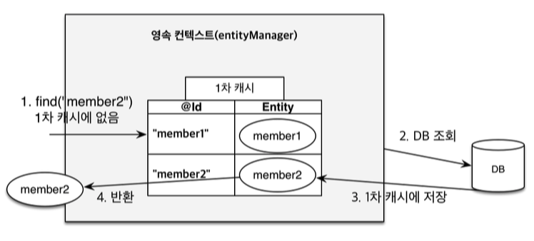

## JPA 
JPA에서 가장 중요한 2가지

1. 객체와 관계형 데이터베이스 매핑

2. 영속석 컨텍스트<br>
"엔티티를 영구 저장하는 환경" 이라는 뜻 논리적인 개념이며 눈에 보이지 않는다.<br>
엔티티매니저를 통해서 영속성 컨텍스트에 접근한다.<br>

<br>
<hr>
<br>

### 엔티티의 생명주기

<br>

1. 비영속(new / transient)<br>
영속성 컨텍스트와 관계가 없는 새로운 상태
```java
Member member = new Member();
member.setId(1L);
member.setUsername("회원1");
```

2. 영속(managed)<br>
영속성 컨텍스트에 관리되는 상태<br>
entityManager 안에 member가 영속 상태로 존재
```java
EntityManager em = emf.createEntityManager();
em.getTransaction().begin();

em.persist(member);
```


3. 준영속(detached)<br>
영속성 컨텍스트에 저장되었다가 분리된 상태
```java
EntityManager em = emf.createEntityManager();
em.getTransaction().begin();

em.persist(member);
em.detach(member);
```

4. 삭제(removed)<br>
삭제된 상태

<br>
<hr>
<br>

### 영속성 컨텍스트 이점
* 1차 캐시




* 동일성(identity) 보장

1차 캐시로 조회된 같은 데이터는 동일한 인스턴트를 리턴
```java
Member a = em.find(Member.class, "member1");
Member b = em.find(Member.class, "member1");
System.out.println(a == b); // 동일성 비교 true
```


* 트랜잭션을 지원하는 쓰기 지연 (transactional write-behind)

em.persist(memberA)가 실행 되면 1차 캐시에 저장과 동시에 Insert Query를 생성 하여 **쓰기지연 SQL** 저장소에 저장한다.<br>
em.persist(memberB)가 실행 되면 마찬가지로 1차 캐시에 저장과 동시에 **쓰기지연 SQL** 저장소에 저장한다.<br>
커밋 / 트랜잭션 종료 되는 순간 **쓰기지연 SQL** 이 일괄로 데이터 베이스에 SQL을 전달 한다.
```java
EntityManager em = emf.createEntityManager();
EntityTransaction tx = em.getTransaction();
tx.begin();

Member memberA = new Member(1L, "A");
Member memberB = new Member(1L, "B");

em.persist(memberA);
em.persist(memberB);

tx.commit();    // Commit 하는 순간 데이터 베이스에 Insert SQL을 전달
```


* 변경 감지(Dirty Checking)

트랜잭션 커밋 하는 순간 1차 캐시에서 엔티티와 스탭샷을 비교한다.<br>
엔티티 데이터가 변경 감지 되면 쓰기지연 SQL 저장소에 update SQL을 저장한다.<br>
이후 데이터 베이스에 전달한다.<br>

```java
EntityManager em = emf.createEntityManager();
EntityTransaction tx = em.getTransaction();
tx.begin();

Member member = em.find(Member.class, 1L);
member.setName("znzn9292");

//em.persist(member);   // 변경 감지가 되면 em.persist는 하지 않는게 좋다.

tx.commit();
```
* 지연 로딩(Lazy Loading)
