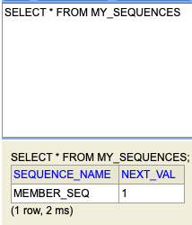

## JPA Flush

<br>

영속성 컨텍스트를 Flush 하는 방법

* em.flush() - 직접 호출
* Transaction Commit - 자동 호출
* JPQL Query 실행 - 자동 호출

<br>

Flush 주의사항
* 영속성 컨텍스트를 비우지 않음
* 영속성 컨텍스트의 변경내용을 데이터베이스에 동기화
* Transaction 이라는 작업 단위가 중요

<br>
<hr>
<br>

## JPA Object & Table Mapping

<br>

1. **@Entity**
    * @Entity 가 붙은 클래스는 JPA가 관리한다.
    * 기본 생성자 필수
    * final class, enum, interface, inner class 사용 X
    * 저장 필드에 final 사용 X

2. **@Table**
    * **name** : 매핑할 테이블 이름
    * **catalog** : 데이터베이스 catalog 매핑
    * **schema** : 데이터베이스 schema 매핑
    * **uniqueConstraints** : DDL 생성 시에 유니크 제약 조건 생성

3. **DataBase Schema 자동 생성**
    * DDL을 애플리케이션 실행 시점에 자동 생성
    * DataBase 방언을 활용해서 DataBase에 맞는 적절한 DDL 생성
    * 생성된 DDL은 개발 장비에서만 사용
    >운영 장비에는 절대 스키마 자동 생성에 주의 하여야 한다 **(create, create-drop, update)**

<br>
<hr>
<br>

## JPA Field & Column Mapping

<br>

```java
@Entity
public class Member {
    @Id
    private Long id;

    @Column(name = "name")  
    private String name;

    private Integer age;

    @Enumerated(EnumType.STRING)
    private RoleType roleType

    @Temporal(TemporalType.TIMESTAMP)
    private Date createdDate;

    @Temporal(TemporalType.TIMESTAMP)
    private Date lastModifiedDate;

    @Lob
    private String description;

    public Member() {

    }
}
```

* **@Column : 컬럼 매핑**

|속성|설명|기본값|
|--|--|--|
|name|필드와 매핑할 테이블의 컬럼이름|객체의 필드 이름|
|insertable, updatable|등록, 변경 가능 여부|true|
|nullable(DDL)|null 값의 허용 여부를 설정한다. false로 설정하면 DDL 생성 시에 not null 제약조건이 붙는다.||
|unique(DDL)|@Table의 uniqueConstraints와 같지만 한 컬럼에 간단히 유니크 제 약조건을 걸 때 사용한다.||
|length(DDL)|문자 길이 제약조건, String 타입에만 사용한다.|255|
<br>

* **@Temporal : 날짜 타입 매핑**
    * LocalDate, LocalDateTime을 사용할 때는 생략 가능 (최신 Hibernate 지원)
    * value 
        * **TamporalType.DATE** : 날짜, 데이터베이스 date 타입과 매핑 (예: 2021-03-30)<br>
        * **TamporalType.TIME** : 시간, 데이터베이스 time 타입과 매핑 (예: 11:11:11)<br>
        * **TamporalType.TIMESTAMP** : 날짜와 시간, 데이터베이스 timestamp 타입과 매핑 (예: 2021-03-30 11:11:11)<br>
* **@Enumerated : enum 타임 매핑**
    * **EnumType.ORDINAL** : enum 순서를 데이터베이스 저장
    * **EnumType.STRING** : enum 이름을 데이터베이스 저장
* **@Lob : BLOB, CLOB 매핑**
    * @Lob 에는 지정할 수 있는 속성이 없음
    * 매핑하는 필드 타입이 문자면 CLOB 매핑, 나머지는 BLOB 매핑
* **@Transient : 특정 필드를 데이터베이트 컬럼 매핑 제외**
    * 필드 매핑 제외
    * 메모리 상에서만 어떤 값을 보관하고 싶을 때 사용

<br>
<hr>
<br>

## JPA Default Key Mapping

<br>

* 직접 할당 : @Id 사용
* 자동 할당 : @GeneratedValue

<br>

@GeneratedValue 전략 - IDENTITY
```java
@Id
@GeneratedValue(strategy = GenerationType.IDENTITY)
prvate Long id;
```
* MySQL 의 **auto_increment**
* **auto_increment**는 키가 NULL 로 들어와야 값이 증가하므로 Insert SQL 을 실행 한 이후에 ID값을 알 수 있음
* em.persist() 시점에 바로 commit 됨

@GeneratedValue 전략 - SEQUENCE
```java
@Id
@GeneratedValue(strategy = GenerationType.SEQUENCE)
prvate Long id;
```
* Oracle 의 sequence
* @SequenceGenerator의 속성 sequenceName을 지정하면 해당 이름의 시퀀스와 매핑됨


@GeneratedValue 전략 - TABLE
```java
@Entity
@TableGenerator(
            name = "MEMBER_SEQ_GENERATOR",
            table = "MY_SEQUENCES",
            pkColumnValue = “MEMBER_SEQ", allocationSize = 1)
    public class Member {
    @Id
    @GeneratedValue(strategy = GenerationType.TABLE, 
                generator = "MEMBER_SEQ_GENERATOR")
    prvate Long id;
}
```

실행결과


* 키 생성 전용 테이블을 하나 만들어서 DataBase Sequence를 흉내내는 전략
* 모든 데이터베이스에 적용 가능

|속성|설명|기본값|
|--|--|--|
|name|식별자 생성기 이름|필수|
|table|키생성 테이블명|hibernate_sequences|
|pkColumnName|시퀀스 컬럼명|sequence_name|
|valueColumnNa|시퀀스 값 컬럼명|next_val|
|pkColumnValue|키로 사용할 값 이름|엔티티 이름|
|initialValue|초기 값, 마지막으로 생성된 값이 기준|0|
|allocationSize|시퀀스 한 번 호출에 증가하는 수(성능 최적화에 사용됨)|50|