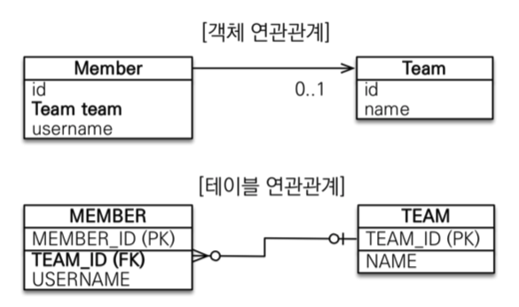
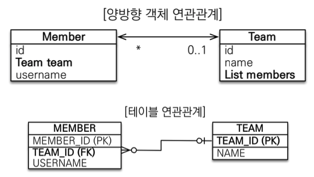
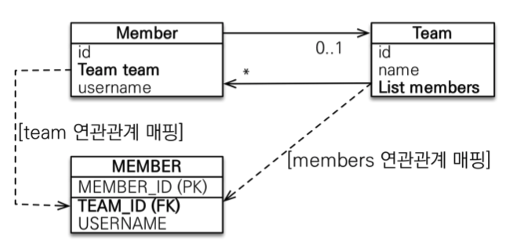

## JPA 연관관계

<br>

객체를 테이블에 맞추어 데이터 중심으로 모델링하면, 협력 관계를 만들 수 없다. <br>

Team.java
```java
@Entity
public class Team {

@Id 
@GeneratedValue
@Column(name = "TEAM_ID")
private Long id;

@Column(name = "NAME")
private String name;
```

Member.java
```java
@Entity
public class Member {
@Id
@GeneratedValue
@Column(name = "MEMBER_ID")
private Long id;

@Column(name = "USERNAME")
private String username;

@Column(name = "TEAM_ID")
private Long teamId;
```

Sample
```java
// Team 생성
Team team = new Team();
team.setName("TeamA");
em.persist(team);

// Member 생성
Member member = new Member();
member.setUsername("member1");
member.setTeamId(team.getId());
em.persist(member);

// 데이터 조회
Member findMember = em.find(Member.class, member.getId());  // Member 조회
Long teamId = findMember.getTeamId();   // 해당하는 Team 식별자 찾아서
Team findTeam = em.find(Team.class, teamId);    // Team 조회
```

이러한 코드는 연관관계가 존재하지 않는 문제가 있다. <br>
특정 Member가 소속된 Team을 찾으려고 할 때 데이터베이스에서 키에 해당하는 데이터를 계속 찾아야 한다. <br>
객체 지향적인 방법이 아니라고 할 수 있다. <br><br>

그럼, 객체지향 연관관계 모델링을 알아보자

<br>
<hr>
<br>

### 단방향 연관관계

<br>

**Member**와 **Team** 은 **N:1 관계** 이고 한개 **Team** 에 여러 **Member**가 존재한다. <br> 
테이블 연관관계에서는 **TEAM_ID** 라는 식별자를 꼭 가져야 하지만 객체 연관관계에서는 이를 따라가면 좋지 않다. <br>



<br>

객체 연관관계는 **TEAM** 의 참조값을 그대로 가져와야 연관관계 매핑이 된다. <br>

Member.java
```java
@Entity
public class Member {
    @Id
    @GeneratedValue
    @Column(name = "MEMBER_ID")
    private Long id;

    @Column(name = "USERNAME")
    private String username;

//    @Column(name = "TEAM_ID")
//    private Long teamId;

    @ManyToOne
    @JoinColumn(name = "TEAM_ID")
    private Team team;
```

* **@ManyToOne** : Member 입장에서 Team의 참조값을 가지기 때문에 **N:1 관계** 이고 **ManyToOne** 관계를 형성
* **@JoinColumn** : **Team** 객체와 **TEAM_ID** 컬럼과 매핑

<br>
<hr>
<br>

### 양방향 연관관계

<br>

테이블 연관관계 기준으로 **Member**와 **Team**은 서로 식별자가 있기 때문에 서로 간 입장을 고려 하지 않고 조인으로 조회가 가능하다. <br>
하지만, 위에 객체 연관관계에서 **Member**에는 **Team**의 참조값이 있지만 **Team**에는 **Member**의 참조값이 없다.<br>
그 말은 **Team** 기준으로 소속된 **Member**를 찾을 수 없다는 말이다.<br>



<br>

양방향 연관관계를 설정하면 **Member** -> **Team** , **Team** -> **Member** 서로 간 참조가 가능하다. <br>

Team.java
```java
@Entity
public class Team {

    @Id @GeneratedValue
    @Column(name = "TEAM_ID")
    private Long id;

    private String name;

    @OneToMany(mappedBy = "team")
    private List<Member> members = new ArrayList<>(); // new ArrayList<>() 초기화는 관례로 사용
```

Sample
```java
Member findMember = em.find(Member.class, member.getId());
List<Member> members = findMember.getTeam().getMembers();
```
* **@OneToMany** : Team 입장에서 Member의 참조값을 가지기 때문에 **1:N 관계** 이고 **OneToMany** 관계를 형성
    * mappedBy : ~에 의해 매핑되고 있는지 의미함, 관계를 형성하고 있는 반대편 객체 변수명을 설정

<br>
<hr>
<br>

### 양방향 연관관계의 주인
* 객체 관계에서는 단뱡향을 사용 하는 편이 좋다.
* 양방향 연관관계에서 외래키를 관리하고 있는 객체를 주인으로 정해야함




