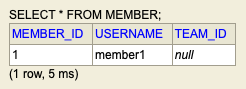
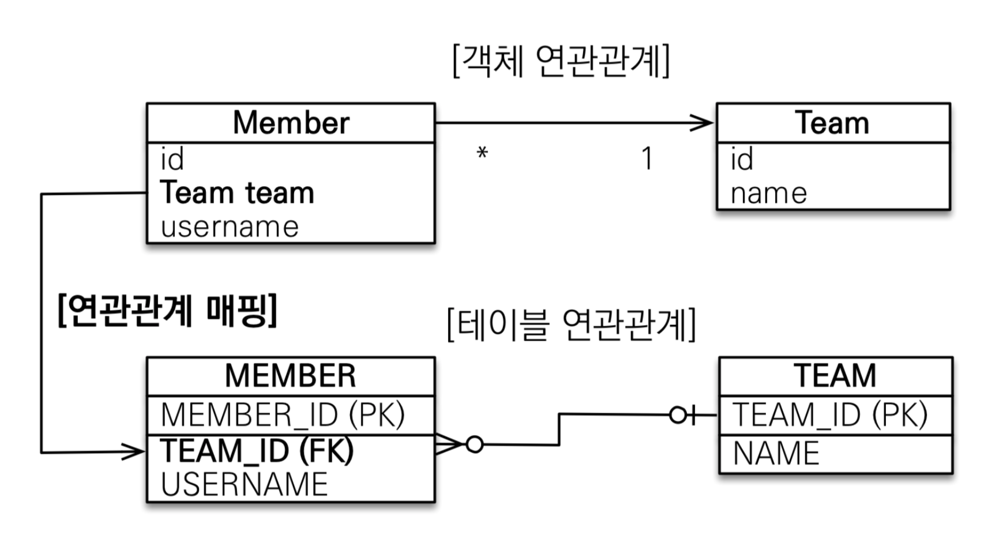
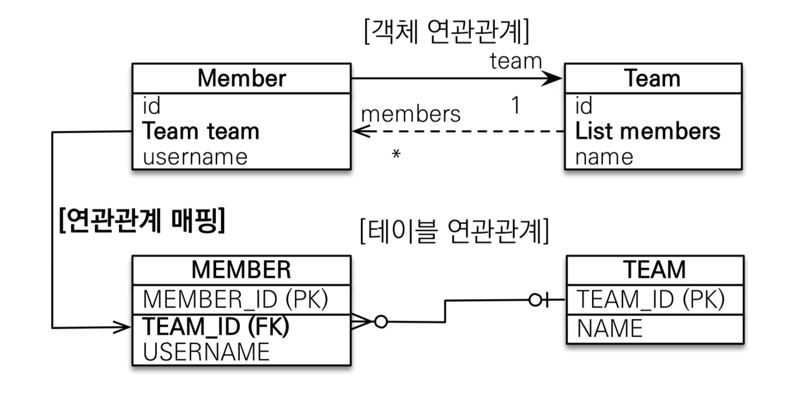
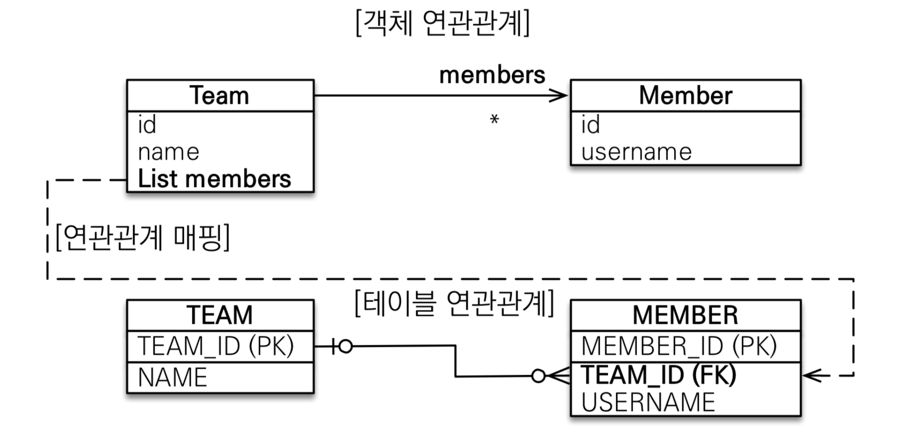
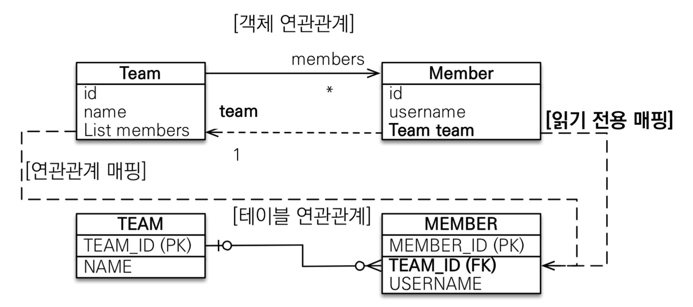

## JPA 다양한 연관 관계

<br>

* ### 양방향 매핑 시 주의 사항 <br>
```java
Member member = new Member();
member.setUsername("member1");
em.persist(member);

Team team = new Team();
team.setName("TeamA");

// 역방향(주인이 아닌 방향)만 연관관계 설정
team.getMembers().add(member);
em.persist(team);
```



연관관계에서 주인이 아닌 다른 방향은 ReadOnly 성격을 나타내기 때문에 **TEAM_ID**가 null 이 된다.<br>
양방향 연관관계 매핑 시에는 연관관계 주인에 값을 입력해야 하며 항상 주의해야 한다.

<br>
**양방향 연관관계 매핑 시에는 항상 양쪽 모두 매핑 해주는 것으로 해결 할 수 있다**

```java
Team team = new Team();
team.setName("TeamA");
em.persist(team);

Member member = new Member();
member.setUsername("member1");
member.setTeam(team);
em.persist(member);

team.getMembers().add(member);

em.flush();
em.clear();
```


* 다대일 단방향 [ N : 1 ]




* 다대일 양방향 [ N : 1 ]



* 일대다 단방향 [ 1 : N ]




* 일대다 양방향 [ 1 : N ]


