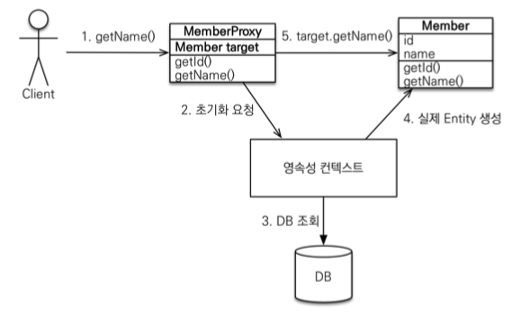

## JPA Proxy

 

연관관계가 있는 A Entity와 B Entity가 있다고 가정하자.  
비즈니스 로직에서 A Entity 객체만 사용 한다면 굳이 B Entity 데이터를 조회할 필요는 없다.  
계속해서 불필요한 B Entity 데이터를 조회 하게 된다면 성능이 저하 되고 최적화에 실패 할 것이다.

* Proxy 기초
    * **em.find()** : 데이터베이스틑 통해 실제 Entity 객체를 조회
    * **em.getReference()** : 데이터베이스 조회를 미루는 가짜(Proxy) Entity 객체를 조회
    > em.getReference()에서 반환 객체는 Id 값만 가지고 있고 다른 내용이 모두 비어있다.

* Proxy 특징
    * Hibernate가 Entity 클래스를 상속 받아서 만듬
    * 진짜 객체인지 Proxy 객체인지 구별하지 않고 사용하면 됨
    * Proxy 객체는 실제 객체의 참고(target)을 보관

* Proxy 객체의 초기화

    
