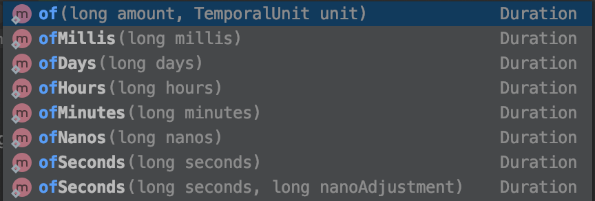

## JUnit Assertion
<br>

### assertEquals
```java
// 오류 메세지 람다 표현
assertEquals(StudyStatus.DRAFT, study.getStatus(), () -> "스터디를 처음 만들면 DRAFT 상태다.");

// 오류 메세지 일반 문자열 표현
assertEquals(StudyStatus.DRAFT, study.getStatus(), "스터디를 처음 만들면 DRAFT 상태다.");
```
* StudyStatus.DRAFT 값과 study.getStatus() 값이 일치하는지 확인
* 불일치 하여 오류 발생 시 세번째 파라미터 문자열을 출력
* 메세징 람다 사용 => **실패 했을때만 해당 메세지 연산을 함 (성능 입장에서 유리함)**
  메세징 문자열 사용 => **성공, 실패 모두 연산을 함 (문자 연산에 비용이 걱정이 됨)**

<br>

### assertAll
```java
assertAll(
        () -> assertNotNull(study),
        () -> assertEquals(StudyStatus.DRAFT, study.getStatus(),
                () -> "스터디를 처음 만들면 DRAFT 상태다."),
        () -> assertTrue(study.getLimit() > 0, "스터디 최대 참석 가능 인원은 0보다 커야 한다." )
);
```
>assert 로 실행 되는 테스트 기능을 다수 호출 후 오류 발생 되었을 때 하단에 호출한 assert 함수는 호출 되지 않음

* assertAll() 로 테스트 기능을 묶어 사용 하면 전부 실행 시킬 수 있음
* 한번에 모든 테스트를 할 수 있다는 장점이 있음

<br>

### assertThrows
```java
public Study(int limit) {
    if(limit < 0) {
        throw new IllegalArgumentException("limit은 0보다 커야 한다");
    }
    this.limit = limit;
}

@Test
@DisplayName("스터디 만들기 - assertThrows")
void create_new_study_assertThrows() {
    IllegalArgumentException exception = assertThrows(IllegalArgumentException.class, () -> new Study(-10));
    String message = exception.getMessage();

    assertEquals("limit은 0보다 커야 한다", message);
}
```

* 특정한 목적으로 인해 Exception 을 테스트 할 경우 사용

<br>

### assertTimeout
```java
assertTimeout(Duration.ofMillis(300), () -> {
    new Study(10);
    Thread.sleep(300);
});
```

* Duration.ofMillis() 특정 시간안에 실행이 완료 되는지 확인 
* 시간 단위를 설정 할 수 있음


