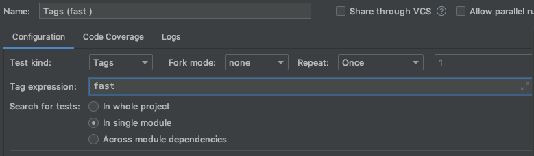
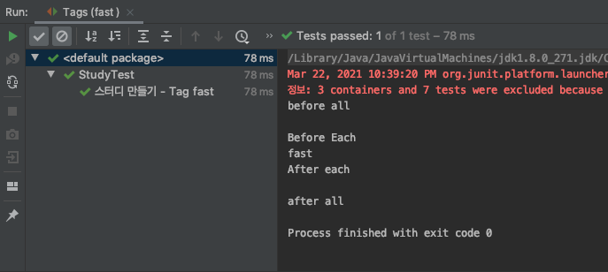
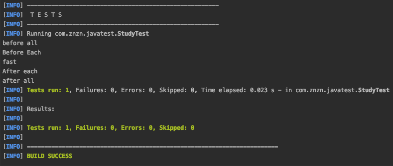
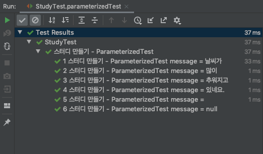

## JUnit Tag & Filtering (태깅과 필터링)
<br>

우리가 만든 테스트가 여러개 있다면 해당 테스트들을 특정한 이유로 그룹화 또는 모듈별로 실행 할 수 있다.<br>
태깅 하는 몇 가지 방법을 알아보자.

1. ### @Tag
* 테스트 메소드에 **@Tag** 어노테이션을 사용하여 태깅

```java
@DisplayName("스터디 만들기 - Tag fast")
@Tag("fast")    // Run/Debug Configurations 에서 Test Kind : Tags, Tag expressions: fast 설정 시 해당 테스트만 실행
void create_new_tag_fast() {
    System.out.println("fast");
    Study actual = new Study(100);
    assertThat(actual.getLimit()).isGreaterThan(0);
}

@DisplayName("스터디 만들기 - Tag slow")
@Tag("slow")    // Run/Debug Configurations 에서 Test Kind : Tags, Tag expressions: slow 설정 시 해당 테스트만 실행
void create_new_tag_slow() {
    System.out.println("slow");
}
```
<br><br><br>
**fast** 로 태깅된 테스트만 실행 하기 위해서는 IntelliJ IDEA 내에 **Run/Debug Configurations** 에서 **Test Kind : Tags** 로 설정 해줘야 한다.


<br><br><br>


테스트 실행 하면 **slow** 는 테스트에서 제외 되었고 태깅 설정한 **fast** 테스트만 실행 되었다.



<br><br>
<hr>
<br><br>

2. Maven Config
* 메이븐 설정으로 profile을 추가하여 태깅

pom.xml
```xml
<profiles>
    <profile>
        <id>default</id>
        <activation>
            <activeByDefault>true</activeByDefault>
        </activation>
        <build>
            <plugins>
                <plugin>
                    <artifactId>maven-surefire-plugin</artifactId>
                    <configuration>
                        <groups>fast</groups>
                    </configuration>
                </plugin>
            </plugins>
        </build>
    </profile>
</profiles>
```

위와 같이 **fast** profile을 추가하여 테스트 실행 환경을 구성한다.<br><br>

```
./mvnw test
```


**fast** 태깅 테스트만 실행 된 것을 확인 할 수 있다.

<br><br>
<hr>
<br><br>


## JUnit Test 반복하기
<br>

특정 테스트에 대해서 반복적으로 검증하여 진행 하는 것도 좋은 방법이다.<br>
테스트 반복하는 방법을 알아보자.<br><br>

1. ### @RepeatedTest
테스트 메소드에 **@RepeatedTest** 어노테이션을 사용하여 반복

```java
@DisplayName("스터디 만들기 - repeat")
@RepeatedTest(value = 10, name = "{displayName}, {currentRepetition} / {totalRepetitions}") 
void repeatTest(RepetitionInfo repetitionInfo){
    System.out.println("test " + repetitionInfo.getCurrentRepetition() + " / " + repetitionInfo.getTotalRepetitions());
}
```

>* value : 반복 횟수 지정
>* {displayName} : @DisplayName 으로 지정한 테스트 명칭
>* {currentRepetition} : 현재 반복 횟수 
>* {totalRepetitions} : 총 반복 횟수

<br>

이때 반복 테스트 작성 코드에 RepetitionInfo 타입의 인자를 받아 반복 정보를 출력 할 수 있다.
>* repetitionInfo.getCurrentRepetition() : 현재 반복 횟수
>* repetitionInfo.getTotalRepetitions() : 총 반복 횟수

<br><br>
<hr>
<br><br>

2. ### @ParameterizedTest
Junit5는 기본적으로 제공 되어 있는 기능이며, Junit4는 서드파티 라이브러리를 사용 해야만 사용 가능하다.

```java
@DisplayName("스터디 만들기 - ParameterizedTest")
@ParameterizedTest(name = "{index} {displayName} message = {0}")
@ValueSource(strings = {"날씨가", "많이", "추워지고", "있네요."})
void parameterizedTest(String message) {
    System.out.println(message);
}
```

@ValueSource에 정의 되어진 배열 크기 만큼 테스트가 진행 되고 0 인덱스 부터 **message** 변수안에 파라미터로 들어와 테스트를 진행 하게 된다.


여기서, 추가적으로 빈 값이나 null을 파라미터로 들어오는 테스트를 실행 하고 싶다면<br>
**@EmptySource**, **@NullSource** 를 사용 하면 된다. 

```java
@DisplayName("스터디 만들기 - ParameterizedTest")
@ParameterizedTest(name = "{index} {displayName} message = {0}")
@ValueSource(strings = {"날씨가", "많이", "추워지고", "있네요."})
@EmptySource    // 추가로 공백이 파라미터에 들어옴
@NullSource     // 추가로 null이 파라미터에 들어옴
@NullAndEmptySource // @EmptySource + @NullSource 의 효과를 낼수 있음
void parameterizedTest(String message) {
    System.out.println(message);
}
```

그럼, **@ValueSource** 안에 배열 크기만큼 반복되고 공백과 null이 추가로 진행 된다.



