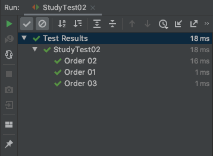

## JUnit Test Instance
<br>

Junit이 테스트를 실행 할때 인스턴스 만드는 기본 전략은 메소드마다 인스턴스를 생성을 하는 것이다.<br>
테스트 인스턴스를 하나만 사용 하게 되면 하면 값을 공유 하기 때문에 각 테스트 마다 실행 되는 테스트가 불안정 할 수 있다.<br>
그래서 개발자가 따로 설정 하지 않는다면 자원을 공유하지 않고 테스트 간에 의존을 하지 않는다.<br>

하지만, 자원을 공유 해야 할 상황을 대비해 알아 보도록 하자.

```java
@TestInstance(TestInstance.Lifecycle.PER_CLASS)
```

**@TestInstance** 어노테이션을 사용하면 하나의 인스턴스만 생성 되고 테스트 메소드 들이 해당 인스턴스만 바로보게 되어 멤버변수의 값을 공유 할 수 있다.

<br><br>
<hr>
<br><br>

## JUnit Test Order
<br>

JUnit이 테스트를 실행 할때 정해진 로직에 따라 순서대로 실행이 되긴 하지만 우리는 그 순서에 의존하면 안된다.<br>
언제라도 바뀔 수 있다고 한다. 그럼, 개발자가 직접 테스트 순서를 정의 하는 방법은 아래와 같다. 

```java
@TestMethodOrder(MethodOrderer.OrderAnnotation.class)
```

```java
@DisplayNameGeneration(DisplayNameGenerator.ReplaceUnderscores.class)
@TestInstance(TestInstance.Lifecycle.PER_CLASS)
@TestMethodOrder(MethodOrderer.OrderAnnotation.class)
class StudyTest02 {

    @Order(2)
    @DisplayName("Order 2")
    @Test
    void create_order_02() {
        System.out.println("Order 2");
    }

    @Order(1)
    @DisplayName("Order 1")
    @Test
    void create_order_01() {
        System.out.println("Order 1");
    }
    
    @Order(3)
    @DisplayName("Order 3")
    @Test
    void create_order_03() {
        System.out.println("Order 3");
    }
}
```

테스트 클래스에 **@TestMethodOrder** 어노테이션을 사용하여 **@Order** 안에 순서를 정의 한다.



결과는 정의한 순서대로 테스트가 실행 된다.


