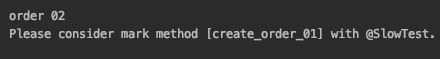

## JUnit 확장모델
<br>

Junit5에서는 Extension 이라는 확장모델로 통합 되었다.<br>
여러가지로 정의 할 수 있는 확장 모델이 있지만 그 중 가장 간단한 Test Lifecycle Callbacks 를 이용하여<br>
실행 시간이 오래걸리는 테스트를 찾아서 경고 메세지를 출력하는 Extension을 작성 할 것이다.<br>

* 그 외 여러 확장모델 참고<br>
https://junit.org/junit5/docs/current/user-guide/#extensions
<br>

먼저, **BeforeTestExecutionCallback**, **AfterTestExecutionCallback** 인터페이스를 구현 합니다.<br>

**beforeTestExecution** 구현체는 현재 시간을 Store 하는 기능이고,<br>
**afterTestExecution** 구현체는 테스트 경과 시간을 구하여 정해진 시간보다 오래 걸리면 메세지 출력하는 기능이다.<br><br>
여기서, **ExtensionContext** 인터페이스에 Store 란 개념이 있는데 특정 값을 넣고 빼는 간단한 기능이라고 생각하면 된다.

```java
public class FindSlowTestExtension implements BeforeTestExecutionCallback, AfterTestExecutionCallback {

    private static final long THRESHOLD = 1000L;

    @Override
    public void beforeTestExecution(ExtensionContext context) throws Exception {
        ExtensionContext.Store store = getStore(context);
        store.put("START_TIME", System.currentTimeMillis());
    }

    @Override
    public void afterTestExecution(ExtensionContext context) throws Exception {
        Method requiredTestMethod = context.getRequiredTestMethod();
        SlowTest annotation = requiredTestMethod.getAnnotation(SlowTest.class);

        String testMethodName = context.getRequiredTestMethod().getName();
        ExtensionContext.Store store = getStore(context);

        Long start_time = store.remove("START_TIME", long.class);
        long duration = System.currentTimeMillis() - start_time;
        if(duration > THRESHOLD && annotation == null){
            System.out.printf("Please consider mark method [%s] with @SlowTest. \n", testMethodName);
        }
    }

    private ExtensionContext.Store getStore(ExtensionContext context) {
        String testClassName = context.getRequiredTestClass().getName();
        String testMethodName = context.getRequiredTestMethod().getName();
        return context.getStore(ExtensionContext.Namespace.create(testClassName, testMethodName));
    }
}
```

```java
private ExtensionContext.Store getStore(ExtensionContext context) {
    String testClassName = context.getRequiredTestClass().getName();
    String testMethodName = context.getRequiredTestMethod().getName();
    return context.getStore(ExtensionContext.Namespace.create(testClassName, testMethodName));
}
```

작성한 확장모델을 실행 시키는 방법

1. **선언적인 등록 (@ExtendWith)**

```java
@ExtendWith(FindSlowTestExtension.class)
class StudyTest01 {

    @DisplayName("Order 01")
    @Test
    void create_order_02() {
        System.out.println("order 01");
    }

    @DisplayName("Order 02")
    @Test
    void create_order_01() throws InterruptedException {
        Thread.sleep(1005L);
        System.out.println("order 02");
    }

    @DisplayName("Order 03")
    @Test
    void create_order_03() {
        System.out.println("order 03");
    }
}
```
<br>

**Order 02** 테스트dp 1초 이상 경과 되도록 설정 하고 실행 해보면 
**Order 02** 테스트에 @SlowTest 어노테이션을 추가 하라는 경고 메세지가 출력 된다.




2. **필드 등록 (@RegisterExtension)**

**FindSlowTestExtension** 클래스에 **THRESHOLD** 멤버변수를 생성자로 값을 할당 받도록 수정한다.

```java
private long THRESHOLD;

public FindSlowTestExtension(Long THRESHOLD) {
    this.THRESHOLD = THRESHOLD;
}
```

```java
//@ExtendWith(FindSlowTestExtension.class)
class StudyTest02 {

    @RegisterExtension
    static FindSlowTestExtension findSlowTestExtension = new FindSlowTestExtension(1000L);

    @DisplayName("Order 01")
    @Test
    void create_order_02() {
        System.out.println("order 01");
    }

    @DisplayName("Order 02")
    @Test
    void create_order_01() throws InterruptedException {
        Thread.sleep(1005L);
        System.out.println("order 02");
    }

    @DisplayName("Order 03")
    @Test
    void create_order_03() {
        System.out.println("order 03");
    }
}
```

**FindSlowTestExtension** 인스턴스를 만들기만 하면 Extension이 적용 된다.
결과는 동일하게 @SlowTest 어노테이션을 추가 하라는 메세지가 출력 된다.


 


