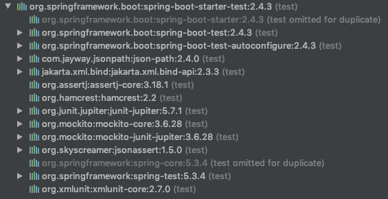

## Mockito

Mockito는 Mock 객체를 쉽게 만들며 관리하고 검증 할 수 있는 방법

Spring Boot 환경에서는 기본으로 **spring-boot-starter-test** 라는 의존성이 따로오게 된다.
이 안에 Mockito도 함께 포함이 되어있다.



**spring-boot-starter-test** 가 없다면 아래 의존을 직접 설정 해줘야 한다.

```xml
<dependency>
    <groupId>org.mockito</groupId>
    <artifactId>mockito-core</artifactId>
    <version>3.1.0</version>
    <scope>test</scope>
</dependency>


<dependency>
    <groupId>org.mockito</groupId>
    <artifactId>mockito-junit-jupiter</artifactId>
    <version>3.1.0</version>
    <scope>test</scope>
</dependency>
```

<br>
<hr>
<br>

```java
public interface MemberService {

    Optional<Member> findById(Long memberId);

}

public interface StudyRepository extends JpaRepository<Study, Long> {

}

public StudyService(MemberService memberService, StudyRepository repository) {
        assert memberService != null;
        assert repository != null;
        this.memberService = memberService;
        this.repository = repository;
    }
```


```java
@Test
void createStudyService() {
    StudyService studyService = new StudyService(memberService, studyRepository);
    assertNotNull(studyService);
}
```
**StudyService** 인스턴스를 생성 하려면 생성자에 **MemberService**, **StudyRepository** 객체를 필요로 한다.<br>
하지만, 인터페이스의 경우 인스턴스를 생성 하려면 테스트 메소드 안에 구현체가 정의 되어야 한다.
그러면 테스트 코드가 장황해지며 가독성이 떨어진다. 이때 Mock객체로 임의의 객체를 만들면 해결 할 수 있다.

### Mock 객체 생성 방법 1 - Mokito 인스턴트 이용
```java
import static org.mockito.Mockito.mock;
class StudyServiceTest {

    @Test
    void createStudyService() {
        MemberService memberService = mock(MemberService.class);
        StudyRepository studyRepository = mock(StudyRepository.class);
    }
}
```
### Mock 객체 생성 방법 2 - @ExtendWith, @Mock 어노테이션을 활용한 멤버변수 이용
```java
@ExtendWith(MockitoExtension.class)
class StudyServiceTest {

    @Mock MemberService memberService;
    @Mock StudyRepository studyRepository;

    @Test
    void createStudyService() {
        StudyService studyService = new StudyService(memberService, studyRepository);
        assertNotNull(studyService);
    }
}
```
### Mock 객체 생성 방법 3 - @ExtendWith, @Mock 어노테이션을 활용한 매개변수로 이용
```java
@ExtendWith(MockitoExtension.class)
class StudyServiceTest {
    
    @Test
    void createStudyService(@Mock MemberService memberService,
                            @Mock StudyRepository studyRepository) {
        StudyService studyService = new StudyService(memberService, studyRepository);
        assertNotNull(studyService);
    }
}
```


