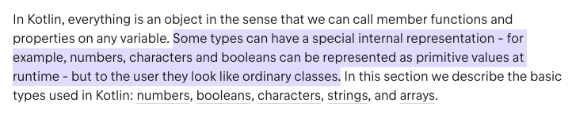

# 1. 코틀린에서 변수와 타입, 연산자를 다루는 방법

## 1.1. 코틀린에서 변수를 다루는 방법

### 가변, 불변의 차이

#### Java
```java
long number1 = 10L;
final long number2 = 20L;
```

#### Kotlin
```kotlin
var number1 = 10L 
val number2 = 20L
```
* 자바에서 `long`과 `final long`은 가변, 불변이며 코틀린에서 `var`와 `val`은 가변, 불변
* `var` 은 `variable` 약자, `val` 은 `value` 약자

> tip, 모든 변수는 우선 val로 만들고 꼭 필요한 경우 var로 변경

<br>

### 초기화 지정
#### Kotlin
```kotlin
var number1: Long
pringln(a) // 컴파일 에러, Variable 'a' must be initialize 
```
* 초기 값을 지정하지 않는 경우 타입을 명시 해줘야 함
* 값을 할당 하지 않은 경우 컴파일 에러가 발생

<br>

### Basic 타입 (Primitive Type, Reference Type)

#### Java
```java
long number1 = 10L;
Long number3 = 1_000L;
```
#### Kotlin
```kotlin
var number1 = 10L
var number3 = 1_000L
```
* '이펙티브 자바' 책에서 데이터 연산 시 `boxing`과 `unboxing`으로 인한 불필요한 객체생성이 이루어지기 때문에 **reference type** 변수는 최소화 하라고 되어있다.
* 코틀린에서는 Primitive Type과 Reference Type 구분이 없다.<br>
하지만 코드 상에서는 `boxing` 된 타입으로 표현 될지라도 실행 시에는 `unboxing`으로 변환 되며 코틀린이 상황에 따라 적절히 처리를 해준다.


> 숫자, 문자, boolean과 같은 몇몇 타입은 내부적으로 특별한 표현을 갖는다.<br>
> 이 타입들은 실행 시에 Primitive Value로 표현되지만, 코드에서는 평범한 클래스 처럼 보인다.

<br>

### nullable 변수 

#### Kotlin
```kotlin
var number1 = 10L
number3 = null // 컴파일 에러, Null can not be a value of non-nul type Long
```
* 기본적으로 코틀린에서 모든 변수에 null이 들어갈 수 없게끔 설계해놨다.

```kotlin
var number1: Long? = 10L
number3 = null 
```
* null을 넣으려면 데이터 타입에 `?` 와 같은 추가적인 키워드가 필요하다. 
* 참고 - [코틀린에서 null을 다루는 방법](Kotlin/2022-06-30.md) <br>

<br>

### 객체 인스턴스화

#### Java
```java
Person person = new Person("정선환")
```

#### Kotlin
```kotlin
var person = Person("정선환")
```
* 코틀린에서 객체 인스턴스화 할 때에는 `new` 키워드를 붙이지 않아야 한다.

<hr>

## 1.2. 코틀린에서 null을 다루는 방법

### Safe Call (안전한 호출)

#### kotlin
```kotlin
fun main() {
    val str: String? = "ABC"
    println(str.length) // 컴파일 에러
    
    // Safe Call
    println(str?.length) // null 출력
}
```
* **null**이 허용된 변수에 대해서는 `.` 을 이용한 프로퍼티를 바로 사용 할 수 없다.
* **Safe Call** 키워드인 `?.`을 사용하면 `str` 값이 **null**일 경우 **null**을 반환하고, 값이 존재 하면 `.length` 값을 반환한다.

### Elvis 연산자

#### kotlin
```kotlin
fun main() {
    val str: String? = null

    // Safe Call
    println(str?.length) // null 출력

    // Elvis 연산자
    println(str?.length ?: 0) // 0 출력
}
```
* **Safe Call**과 함께 사용 되며 앞의 연산 결과가 **null** 이면 뒤의 값을 사용

### 예제1 [Java코드 -> Kotlin코드]
#### java
```java
public boolean startsWithA1(String str) {
    if(str == null) {
        throw IllegalArgumentException("null이 들어왔습니다.");
    }
    return str.startsWith("A");
}

public boolean startsWithA2(String str) {
    if(str == null) {
        return null;
    }
    return str.startsWith("A");
}

public boolean startsWithA1(String str) {
    if(str == null) {
        return false;
    }
    return str.startsWith("A");
}
```

#### Kotlin
```kotlin
fun startsWithA1(str: String?) {

//    if(str == null) {
//        throw IllegalArgumentException("null이 들어왔습니다.")
//    }
//    return str.startsWith("A")

    str?.startsWith("A")
        ?: throw IllegalArgumentException("null이 들어왔습니다.")

}

fun startsWithA2(str: String?): Boolean? {
//    if(str == null) {
//        return null
//    }
//    return str.startsWith("A");

    return str?.startsWith("A")

}

fun startsWithA3(str: String?): Boolean {
//    if(str == null) {
//        return false;
//    }
//    return str.startsWith("A")

    return str?.startsWith("A") ?: return false
}
```

### **!!** 단언 기호
#### Kotlin
```kotlin
fun startsWith(str: String?): Boolean {
    return str!!.startsWith("A")
}
```
* `str` 변수에 **null**이 들어올수 없다는 단언 기호
* 혹시나 null이 들어오면 NPE가 발생되므로 확실한 경우에만 단언 기호 사용