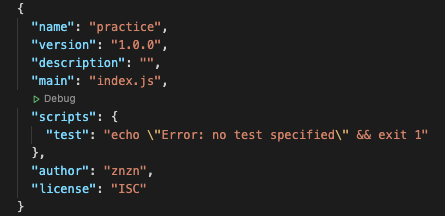
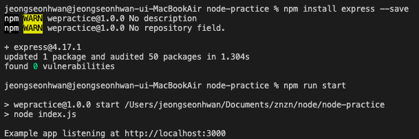
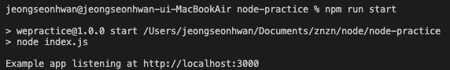
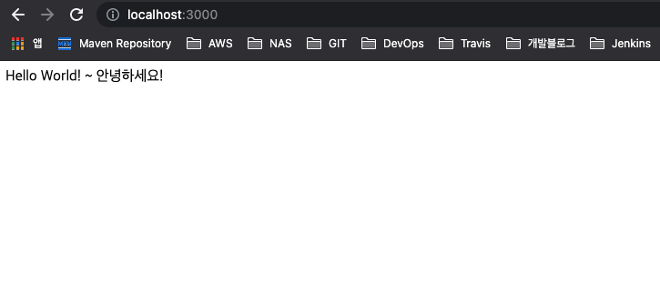
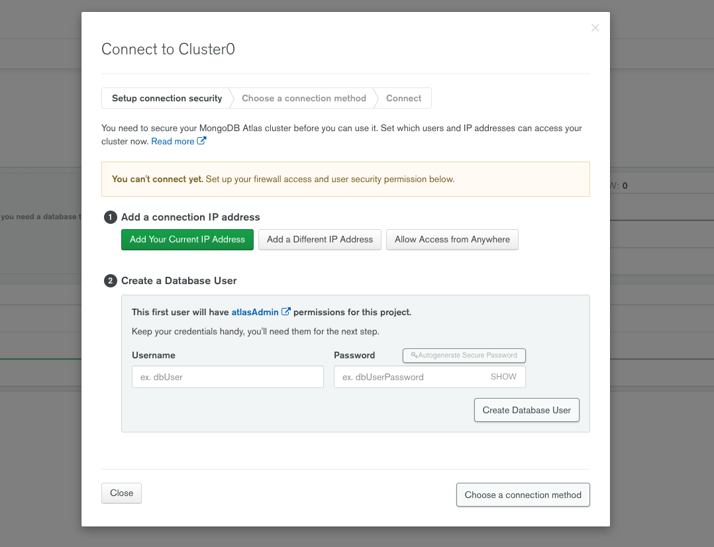
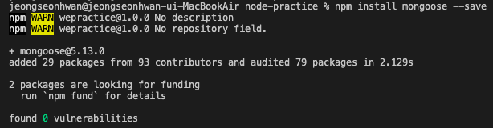
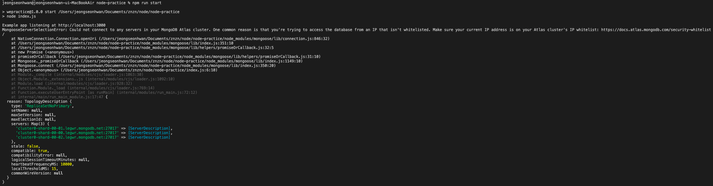
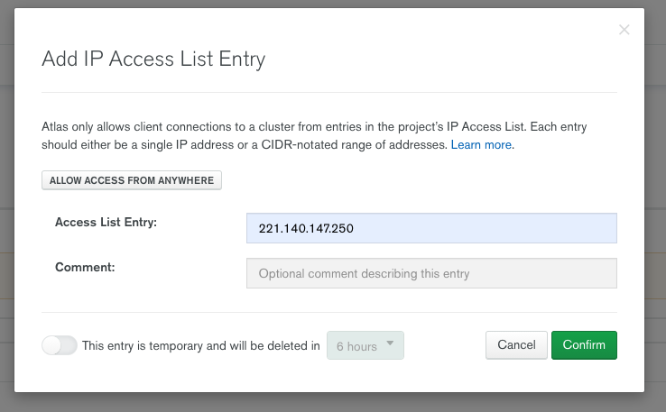
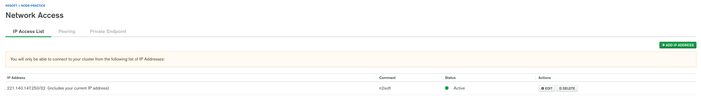
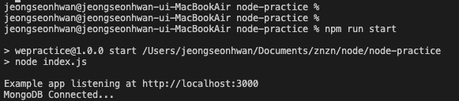

## React - NodeJS 설치 및 세팅

<br>

### NodeJS Version <br>
```
$ node -v   // v14.16.1
```

### npm package Install
```
$ npm init
```

/znzn/node/node-practice/package.json



### expressJS Install
```
$ npm install express --save
```




### 기본적인 express JS 앱 구동
index.js
```js
const express = require('express')
const app = express()
const port = 3000

app.get('/', (req, res) => {
  res.send('Hello World!')
})

app.listen(port, () => {
  console.log(`Example app listening at http://localhost:${port}`)
})
```
* `require('express')` : `express` 모델을 가져옴
* `3000`번 포트로 로컬 서버 구동

package.json
```
"scripts": {
    "start": "node index.js",
    "test": "echo \"Error: no test specified\" && exit 1"
  },
```

npm run
```
$ npm run start
```




<hr>

## React - NodeJS Mongo DB 생성/연결

<br>

### mongoDB 생성
[https://www.mongodb.com/](https://www.mongodb.com/)



* 계정 생성 후 Cluster 생성


### Mongoose(몽구스) Install

MongoDB를 편하게 사용 할 수 있는 Object Modeling Tool 
```
$ npm install mongoose --save
```


### MongoDB Connect

index.js
```js
const mongoose = require('mongoose')
mongoose.connect('mongodb+srv://znzn:<password>@cluster0.legwr.mongodb.net/myFirstDatabase?retryWrites=true&w=majority', {
    useNewUrlParser: true, useUnifiedTopology: true, useCreateIndex: true, useFindAndModify: false
}).then(() => console.log('MongoDB Connected...'))
  .catch(err => console.log(err))
```

* Server Application restart
```
$ npm run start
```


* 접속하려는 IP Address를 접근 할당 해주지 않아 network 에러 발생

### MongoDB Network Access

Network Access 메뉴 -> ADD IP ADDRESS 버튼 



<br>

* 특정 IP를 허용 하려면 Access List Entry 영역에 기재
* 모든 IP 허용은 ALLOW ACCESS FROM ANYWHERE 클릭

설정한 IP 활성화를 위해 Pending 후 Active 



<br>

Server 재기동 확인



<hr>


