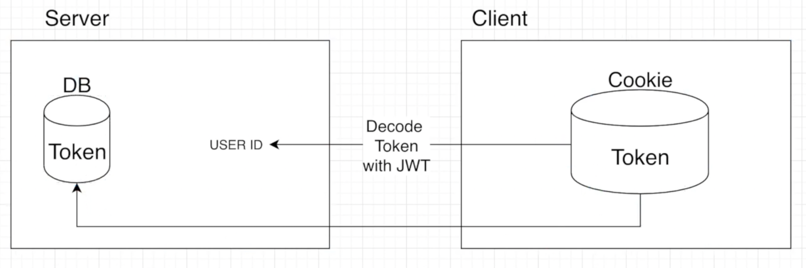

## React - NodeJS JWT

<br>

### Json Web Token (JWT)

계정 검증 완료가 되면 사용자에게 인증 토큰을 발급 해줘야 한다.<br>
발급 토큰은 Json 포맷을 이용하여 사용자에 대한 속성을 저장하는 Claim 기반의 Web Token 형식인 JWT 를 이용 할 것이다.

```
$ npm install jsonwebtoken --save 
```

index.js
```js
app.post('/login', (req, res) => {
  // 요청 이메일 유무 확인
  User.findOne({ email: req.body.email }, (err, user) => {
    if(!user) {
      return res.json({
        loginSuccess: false,
        message: "제공된 이메일에 해당하는 유저가 없습니다."
      })
    }

    // 비밀번호 일치 여부
    user.comparePassword(req.body.password, (err, isMatch) => {
      if(!isMatch) {
        return res.json( { loginSuccess: false, message: "비밀번호가 틀렸습니다." })
      }

      // 토큰 생성
      user.generateToken((err, user) => {
        if(err) {
          return res.status(400).send(err)
        }

        // 클라이언트에 토큰 저장(쿠키 또는 로컬스토리지)
        res.cookie("x_auth", user.token)
        .status(200)
        .json({ loginSuccess: true, userId: user._id})
      })
    })
  })

})
```

* 유효한 계정의 비밀번호 일치여부를 확인 했다면 인증 토큰을 발급한다.
* 발급한 토큰은 `"x_auth"` 라는 키를 가진 쿠키를 생성하여 관리를 한다.

<br>

User.js
```js
// 비밀번호 검증 
userSchema.methods.comparePassword = function (plainPassword, callback) {
    bcrypt.compare(plainPassword, this.password, function(err, isMatch) {
        if(err) {
            return callback
        }

        callback(null, isMatch)
    })
}

// Token 생성
userSchema.methods.generateToken = function (callback) {
    var user = this
    var token = jwt.sign(user._id.toJSON(), 'secretToken')
    user.token = token
    user.save(function(err, user) {
        if(err) {
            return callback(err)
        }

        callback(null, user)
    })
}
```

* `jwt.sign` :  `user._id` 를 `'secretToken'` 이라는 문자열로 해싱하여 생성


### JWT Authentication(인증)
웹사이트는 페이지 별로 로그인이 필요한 페이지와 로그인이 필요하지 않은 페이지가 있을 수 있다. <br>
또한 기능 별 권한에 따른 동작 유무의 체크를 하기 위해서 발급한 JWT 토큰으로 인증을 할 수 있어야 한다.




* Cookie에 저장된 Token을 서버로 전송하고 서버는 Token을 복호화 하여 사용자를 확인한다.
* DB Collection에 사용자를 찾은 후 사용자 데이터를 리턴 한다.

<br>

index.js
```js
// 사용자 인증
app.get('/api/users/auth', auth, (req, res) => {
  res.status(200).json({
    _id: req.user._id,
    isAdmin: req.user.role === 0 ? false : true,
    isAuth: true,
    email: req.user.email,
    name: req.user.name,
    lastname: req.user.lastname,
    role: req.user.role,
    image: req.user.image
  })
})
```

auth.js
```js
const { User } = require("../models/User")

// 인증 프로세스
let auth = (req, res, next) => {
    // 클라이언트 쿠키에서 토큰 가져온다.
    let token = req.cookies.x_auth;

    // 토큰 복호화 & 사용자 조회
    User.findByToken(token, (err, user) => {
        if(err) {
            return err;
        }
        if(!user) {
            return res.json({ isAuth: false, erorr: true})
        }

        req.token = token
        req.user = user
        next()
    })

}

module.exports = { auth }
```

* `req.token = token`, `req.user = user` : `index.js` 레이어에서 업데이트 된 사용자 정보를 사용 및 리턴 해주기 위함

