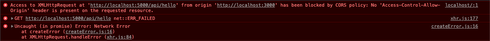
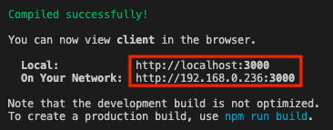
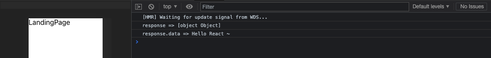
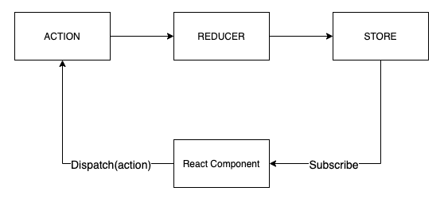

## React Axios

<br>

Axios는 Node.js 환경을 위한 Promise API를 활용하는 HTTP 비동기 통신 라이브러리 <br>
Promise(ES6) API를 사용하고 요청과 응답 데이터의 변경이 용이하다.<br>
HTTP 요청과 응답을 JSON 형태로 변경 해준다. <br>

```
$ npm install axios --save
```
LandingPage/LandingPage.js
```js
import axios from 'axios'

function LandingPage() {
    useEffect(() => {
        axios.get('http://localhost:5000/api/hello')
            .then(response => {
                console.log("response => " + response)
                console.log("response.data => " + response.data)
            })
    }, [])

    return (
        <div>
            LandingPage
        </div>
    )
}
```



* LandingPage 페이지를 열었을 때 axios를 이용해 `http://localhost:5000/api/hello` API를 비동기 호출한다.
* 하지만, CORS 정책 위반 오류가 발생한다. 이유는 현재 React(FrontEnd) 서버 포트는 `3000` 포트를 사용 중이고 NodeJS(BackEnd) 서버는 `5000` 포트를 사용 중 이다.<br>  
  


* CORS 이슈를 해결할 수 있는 방법은 다양하고 여기서는 `http-proxy-middleware` 이라는 proxy 모듈을 사용 할 것이다.

<br>

### http-proxy-middleware

<br>

```
$ npm install http-proxy-middleware --save
```

/client/src/setupProxy.js
```js
const proxy = require('http-proxy-middleware')
module.exports = function (app) {
    app.use(
        '/api',
        proxy({
            target: 'http://localhost:5000',
            changeOrigin: true
        })
    )
}
```
* Node 서버 프록시 타겟 정보를 `http://localhost:5000` 로 설정한다.

LandingPage/LandingPage.js
```js
function LandingPage() {
    useEffect(() => {
        axios.get('/api/hello')
            .then(response => {
                console.log("response => " + response)
                console.log("response.data => " + response.data)
            })
    }, [])

    return (
        <div>
            LandingPage
        </div>
    )
}
```
* API 요청 URI에서 도메인을 제거하고 endpoint를 설정한다.



<br>

<hr>

## React Redux

Props
컴포넌트 간 데이터를 교환 시 Props 사용.
부모컴포넌트 -> 자식컴포넌트로만 가능하고 전달된 데이터는 불변임 (immutable)

State
컴포넌트 간 데이터 교환 시에 데이터가 변할 수 있음( 하지만 재렌더링됨 )


Redux Data FLow (단방향)



npm install redux react-redux redux-promise redux-thunk --save

## React Component

Class Component

```js
import React, { Component } from 'react'

export default class Hello extends Component {
  render() {
    return (
      <div>
        Hello! React!
      </div>
    )
  }
}
```
* 더 많은 기능을 사용 할 수 있다.
* 코드가 길어지고 복잡해질 수 있고 성능면에서도 떨어진다.

Functional Component

```js
import React, { Component } from 'react'

export default function Hello() {
    return (
      <div>
        Hello! React!
      </div>
    )
}
```

* 제공되는 기능에 대해 한정적이다.
* 코드가 짧아지고 성능면에서 조금 더 향상 된다.