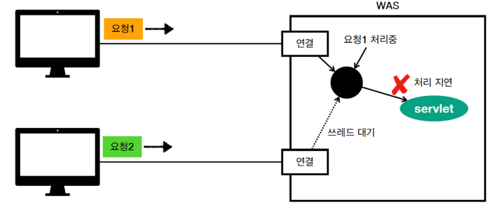

## Spring Chatting

<br>

### RDBMS vs NoSQL (MongoDB)

1. RDBMS

user 테이블
|ID|USERNAME|PHONE|
|--|--|--|
|1|LEE|01011111111|
|2|KIM|01022222222|
|3|PARK|01033333333|

board 테이블
|ID|TITLE|CONTENT|USER_ID|
|--|--|--|--|
|1|제목1|내용1|1|
|2|제목2|내용2|2|
|3|제목3|내용3|3|

<br>
* 데이터를 공유 및 참조하여 중복을 제거한다. <br>
* 데이터가 참조 값으로 매핑 되어 있기 때문에 변경 시 용이하다.
<br>
<br>

2. NoSQL
```
user: [
    {
        ID: 1,
        USERNAME: LEE,
        PHONE: 01011111111
    },
    {
        ID: 2,
        USERNAME: KIM,
        PHONE: 01022222222
    },
    {
        ID: 3,
        USERNAME: PARK,
        PHONE: 01033333333
    },
    
]
```
```
board: [
    {
        ID: 1
        TITLE: 제목1,
        CONTENT: 내용1,
        USERNAME: LEE,
        PHONE: 01011111111
    },
    {
        ID: 2
        TITLE: 제목2,
        CONTENT: 내용2,
        USERNAME: KIM,
        PHONE: 01022222222
    },
    {
        ID: 3
        TITLE: 제목3,
        CONTENT: 내용3,
        USERNAME: PARK,
        PHONE: 01033333333
    }
]
```
* 여러 개의 자바스크립트 오브젝트로 만들어진 데이터 형태
* 데이터 중복을 혀용한다.
* 참조 값이 없어서 테이블을 조인할 필요가 없다. (데이터 조회 시 퍼포먼스가 좋다.)
* 데이터의 일관성을 유지하기 힘들다. (수정이 힘듬)

<hr>

### Spring 4.0
기본적으로 Spring이 서블릿 기반이며, 
사용자가 서버로 요청이 들어올 때마다 쓰레드가 만들어진다.



다중 쓰레드 환경에서 `요청1` 연결이 끝날 때까지 `요청2`는 대기하게 된다. <br>
사용자가 많아져 요청이 늘어날수록 서버 부하가 일어 날 수 밖에 없다.
쓰레드는 Context Switching(문맥 교환) 비용이 많이 발생되므로 서버 속도가 급격히 감소한다.

### Spring 5.0
Reactive 프로그래밍의 탄생으로 비동기와 논블로킹의 새로운 프로그래밍 모델이 제안되었다. <br>
논블로킹은 일반적인 쓰레드를 통한 비동기 작업과는 다르게, 쓰레드를 점유하지 않고 작업을 수행하여 하나의 쓰레드 내에서 동시에 많은 작업을 수행 할 수 있다.

사용자로부터 요청을 받으면 대기열에 작업내용을 기억하고 있다가 요청이 없을 때 처리되기 때문에 
문맥교환이 없어 속도가 빠르다. <br>
또한 비동기 서버를 사용 하려면 DB서버도 비동기 서버인 **MongoDB**를 사용해야 한다. <br>

p.s) R2DBC를 사용하게 되면 RDBMS도 비동기로 사용 할 수 있다.

<br>
<br>

참조) <br>
https://ojt90902.tistory.com/650 <br>
https://taes-k.github.io/2019/05/21/about-spring-reactive/