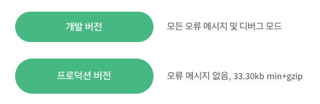

## Node.js 설치

Node.js는 V8이라는 구글에서 개발한 고성능 자바스크립트 엔진으로 빌드된 서버 사이드 개발용 소프트웨어 플랫폼

* Node.js Install (짝수 버전 설치를 권장)<br>
https://nodejs.org/en/ <br>

<br>

* Node.js Install Check <br>
Node.js 를 설치 하게 되면 자동으로 npm을 사용 할 수 있다.
```
$ node -v
$ npm -v
```
<br>
<hr>
<br>

## Vue.js 시작하기

* ### Vue.js Install <br>
1.  Vue.js 직접 참조 <br>
    https://kr.vuejs.org/v2/guide/installation.html
    

    개발 버전으로 **vue.js** 파일을 다운로드 하여 html 파일 안에 직접 참조 한다.
    ```html
    <script src="vue.js"></script>
    ```
2. CDN 참조 <br>
    ```html
    <script src="https://cdn.jsdelivr.net/npm/vue/dist/vue.js"></script>
    ```
<hr>
<br>

* ### 선언적 렌더링 <br>
```html
<div id=app>
    {{msg}}
</div>
```
```js
new Vue({
    el: '#app'
    data: {
        msg: 'Hello Vue!'
    }
})
```
<br>

* ### 디렉티브 <br>
Vue 에서 제공하는 특수 속성이며 렌더링 된 DOM에 특수한 반응형 동작 하고 `v-` 으로 표현 함

1. v-bind


```html
<div id="app">
  <div class="text" v-bind:class="{active: active}">
    {{message}}
  </div>  
</div>
```
```css
.text{
  font-size: 70px;
}
.text.active {
  color: red;
}
```
```js
const vm = new Vue({
  el: '#app',
  data: {
    message: 'Hello Vue!',
    active: true
  }
})
```

2. v-if

Element의 존재 여부를 토글 
```html
<div id="app">
  <p v-if="seen">보여요</p>
</div>
```
```js
var app3 = new Vue({
  el: '#app',
  data: {
    seen: true
  }
})
```
```html
<div id="app">
  <div v-if="message">
   {{message}} ~~
  </div>
</div>
```
```js
const vm = new Vue({
  el: '#app',
  data: {
    show: true,
    message: ''
  }
  
})
```


3. v-for

**v-for="todo in todos"** `todos` 라는 데이터 안에 있는 `todo` 라는 이름으로 정의해서 사용<br>
**v-for**를 사용 할 때는 반드시 **v-bind:key** 라는 각 요소의 키를 지정 해줘야 한다. 
```html
<div id="app">
  <ul>
    <li v-for="item in items" v-bind:key="item.id">
      {{item.message}}  
    </>
  </ul>
</div>
```
```js
const rm = new Vue({
  el: '#app',
  data: {
      items: [
      {
        id: '1',
        message: 'Hello World'
      },
      {
        id: '2',
        message: 'Good Job'
      },
      {
        id: '3',
        message: 'Vue App'
      }
    ]
  }
})
```


    


