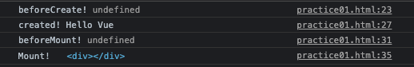
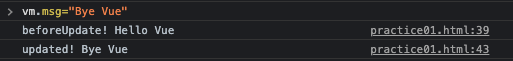
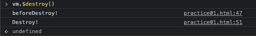

## Vue.js Life Cycle

<br>

Vue 인스턴스 생성 부터 소멸 될 때까지 라이프사이클 정리

```html
<div id="app">
    <div ref="msg">{{msg}}</div>
    <div ref="div"></div>
</div>
```

```js
<script>
const vm = new Vue({
    el: '#app',
    data: {
        msg: 'Hello Vue'
    },
    beforeCreate () {
        console.log('beforeCreate!', this.msg);
    },

    created () {
        console.log('created!', this.msg);
    },
    
    beforeMount () {
        console.log('beforeMount!', this.$refs.div);
    },

    mounted () {
        console.log('Mount!', this.$refs.div);
    },
    
    beforeUpdate () {
        console.log('beforeUpdate!', this.$refs.msg.innerText);
    },

    updated () {
        console.log('updated!', this.$refs.msg.innerText);
    },

    beforeDestroy () {
        console.log('beforeDestroy!');
    },

    destroyed () {
        console.log('Destroy!');
    }
})
</script>
```

1. vm 생성 <br>
    new Vue 인스턴스를 생성

2. `beforeCreate` - Init Events & LifeCycle  <br>
    기본적인 Event 또는 라이프사이클이 정의

3. `created` - Init Injections & reactivity  <br>
    외부모듈이나 기타 뷰에서 기본적인 요소를 주입 ( **data: {}** )

4. `beforemount` - HTMl / DOM 연결 요소 확인  <br>
    el 요소와 Template 정의가 되어 있는지 확인 후 템플릿을 **렌더링 하거나 컴파일**

5. `mounted` - Vue 인스턴스가 특정 HTML / DOM 요소와 연결 완료 <br>
    * `beforeUpdate` - 데이터 변경  <br>
      변경된 데이터를 화면에 그리기 직전

    * `updated` - 데이터 변경 후 <br>
      변경되 데이터를 화면에 렌더링 완료   

6. `beforeDestroy` - Vue 인스턴트가 소멸하기 직전 <br>

7. `destroyed` - watchers, 반응성, 뷰 인스턴트에 소속된 자식 컴포넌트 들도 모두 해제
    
<br>

* 최초 실행 시 Vue 인스턴스 생성하고 렌더링까지 완료됨



* mount가 완료된 msg 값 변경 시 `beforeUpdate`, `updated` 호출 완료



* Vue 인스턴스를 강제 소멸 시켜 destroy 호출 확인 <br>
  더이상 렌더링의 반응성을 유지 하지 않음


