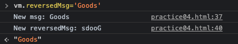

## Vue.js computed

<br>

* ### computed
    * html 코드 내부에 계산 표현식이 존재하다면 가독성이 좋지 않다.
    * JavaScript 표현식을 Vue 인스턴스 내부에서 처리 하도록 정의된 속성 (계산된 속성)
    * computed 에는 cache 기능이 있어 종속된 값에 대해 변경사항이 있을때만 재 랜더링 함

* ### computed vs methods
    * computed 와 methods에 동일한 기능 함수를 정의
    * computed는 연산을 한번만 진행 하고 캐싱에서 렌더링 됨
    * method는 캐싱이라는 개념이 없기 때문에 매번 재 렌더링 됨

```html
<div id="app">
    <div>{{ reverseMsg() }}</div>
    <div>{{ reverseMsg() }}</div>
    <div>{{ reverseMsg() }}</div>
    <div>------------------</div>
    <div>{{ reversedMsg }}</div>
    <div>{{ reversedMsg }}</div>
    <div>{{ reversedMsg }}</div>
</div>
```
```js
<script>
const vm = new Vue({
    el: '#app',
    data: {
        msg: "Hello Vue!"
    },
    computed: {
        reversedMsg () {
            return this.msg.split('').reverse().join('')
        }
    },
    methods: {
        reverseMsg () {
            return this.msg.split('').reverse().join('')
        }
    }
})
</script>
```
* ### computed 추가 사용 예제
    * 서버에서 key가 없는 데이터가 제공 되었을때 더미 데이터를 만들어 렌더링 할 수 있다.
    * 오리지널 데이터에 index 등 추가 데이터를 넣고 실제 루프는 더미 데이터로 사용

```html
<div id="app">
    <div class="todos">
        <div v-for="todo in computedTodos"
                :key="todo.id">
        <input type="checkbox" v-model="todo.done">
        <span>{{ todo.title }}</span>
        </div>
    </div>
</div>
```
```js
<script>
const vm = new Vue({
    el: '#app',
    data: {
        todos: [
            {title: '아침 먹기'},
            {title: '점심 먹기'},
            {title: '저녁 먹기'}
        ]
    },
    computed: {
        computedTodos () {
            return this.todos.map((todo, index) => {
                // 동일 기능

                // return Object.assign({}, todo, {
                //     id: index + 1,
                //     done: false

                // })
                return {
                    ...todo,
                    id: index + 1,
                    done: false
                }
            })
        }
    }
})
</script>
```

* ### Getter / Setter

```js
<script>
const vm = new Vue({
    el: '#app',
    data: {
        msg: "Hello Vue!"
    },
    computed: {
        // reversedMsg () {
        //     return this.msg.split('').reverse().join('')
        // },
        reversedMsg: {
            // Getter
            get () {
                return this.msg.split('').reverse().join('')
            },
            // Setter
            set (value) {
                this.msg = value
            }
        }
    }
    })
</script>
```

* Getter <br>
    computed에 정의된 reversedMsg 함수는 사실 Getter 기능을 포함한다. <br>
    보통 computed에 함수 정의 할 때 Getter로 값 리턴을 해주고 Setter는 필요 시에 정의 하여 사용한다.

* Setter <br>
    `this.msg` 로 `data.msg` 에 접근하여 값을 변경 해준다. <br>
    Setter로 데이터 변경시 당연히 반응성으로 연결된 렌더링 데이터도 화면에서 변경된다.

<br>
<hr>
<br>

## Vue.js Watch

<br>

* ### watch
    * 데이터를 바꾸는 시점 또는 바뀌었을때 특정한 로직을 처리하고 싶을때 사용한다
    * 특정 데이터를 뷰가 감시하고 있다가 변경되는 순간 역할을 수행 하게 해준다.

```js
<script>
    const vm = new Vue({
        el: '#app',
        data: {
            msg: "Hello Vue!"
        },
        computed: {
            reversedMsg: {
                // Getter
                get () {
                    return this.msg.split('').reverse().join('')
                },
                // Setter
                set (value) {
                    this.msg = value
                }
            }
        },
        watch: {
            msg (newMsg) {
                console.log('New msg: ' + newMsg)
            },
            reversedMsg (newMsg) {
                console.log('New reversedMsg: ' + newMsg)
            }

        }
        
    })
</script>
```



reversedMsg를 'Goods' 라는 데이터로 Setter 하였을 때 `watch`로 감시 하고 있는 데이터들이 모두 변경됨
    

    
