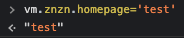

## Vue.js 조건부 렌더링 & 리스트 렌더링

<br>

### 조건부 렌더링 

1. **v-if-else**

* v-if는 요소를 제거하고 재생성 하는 방식으로 동작하기 때문에 토글 비용이 높다.

```html
<body>
<style>
.box {
    width: 100px;
    height: 100px;
}
.box--red {
    background-color: red;
}
.box--blue {
    background-color: blue;
}
.box--gray {
    background-color: gray;
}
</style>

<div id="app">
      <div v-if="colorState === 'red'" class="box box--red"></div>
      <div v-else-if="colorState === 'blue'" class="box box--blue"></div>
      <div v-else class="box box--gray"></div>
</div>
</body>
```
```js
<script>
const vm = new Vue({
    el: '#app',
    data: {
        colorState: 'red'
    }

})
</script>
```
<br>

2. **v-show**

* 요소 자체를 css `display: none' 으로 렌더링 해준다.
* 초기 렌더링 비용이 더 높다.
```html
<style>
.box {
    width: 200px;
    height: 150px;
    background-color: red;
}
</style>

<div id="app">
    <button @click="toggle">Toggle</button>
    <div v-show="show"
        class="box"></div>
</div>
```
```js
<script>
const vm = new Vue({
    el: '#app',
    data: {
        show: false
    },
    methods: {
        toggle () {
            this.show = !this.show
        }
    }
})
</script>
```

> 자주 바꾸기를 원한다면 `v-show`, 런타임 시 조건이 바뀌지 않으면 `v-if` 사용이 효과적

<br>
<hr>
<br>

### 리스트 렌더링 

1. **배열(Array)**

* **todos** 배열 데이터에 각 데이터를 구별 할 수 있는 키 값이 없다면 `v-for`에서 제공 해주는 index를 사용한다. <br> 
* **todos** 배열 데이터에 '야식' 이라는 데이터를 추가 하고 싶을 때 `=` 로 할당해서 사용하면 안된다. <br>
  Vue 공식 문서에서는 배열 변경 감지가 되었을 때 **변이 메소드**를 통해서 갱신을 트리거(반응성 컨트롤) 해야한다.
```html
<body>
<div id="app">
    <button @click="pushTodo">Push</button>
    <ul class="todos">
        <li v-for='(todo, index) in todos'
            :key="index"> 
            
            {{ todo.title }} 

        </li>
    </ul>
</div>
</body>
```
```js
<script>
    const vm = new Vue({
        el: '#app',
        data: {
            todos: [
                { title: '아침'},
                { title: '점심'},
                { title: '저녁'},
            ]
        },
        methods: {
            pushTodo () {
              // this.todos[3] = { title: '야식' }

              // 변이 메소드 push() 사용
              this.todos.push({ title: '야식'})
            }
        }
    })
</script>
```

<br>

2. **객체(Object)**

```html
<body>
<div id="app">
    <ul class="znzn">
        <li v-for="(value, key, index) in znzn"
            :key="index">
            {{ value }}
        </li>
    </ul>
</div>
</body>
```
```js
<script>
const vm = new Vue({
    el: '#app',
    data: {
        znzn: {
            name: 'ZNZN',
            age: 30
        }
    }
})
</script>
```


* 개발자도구 console에서 **data.znzn** 객체 데이터 안에 `homepage`라는 데이터를 넣었을 때 데이터 자체는 삽입이     되지만 반응성이 없기 때문에 화면에 바로 출력 되지 않는다.
* `this.$set` 을 사용 하면 객체에 반응성이 있는 데이터를 추가 할 수 있다.
```js
methods: {
    addHomepage () {
        this.$set(this.znzn, 'homepage', 'znzn.github.com')
    }
}
```