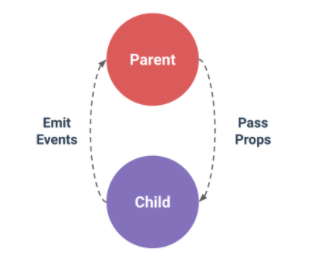

## Vue.js Component Detail

<br>

### Component를 사용해야 하는 고민
* 재사용성 <br>
특정 UI 가 반복적으로 사용 한다고 하면 component로 만드는 것을 고려

* 복잡한 로직 <br>
로직이 복잡해지거나 개념적으로 분류할 필요가 있다고 판단되면 고려

### Component 주의 사항
* 네이밍 (Naming) <br>
기존에 HTML 코드와 중복 될 수 있기 때문에 두 개 단어를 이용해 `-` 기호로 연결하여 네이밍 해야한다.

* data는 반드시 함수 <br>
자바스크립트에서 객체(Object)는 mutable 속성을 가진다. <br>
component는 재사용을 사용한다는 전제가 주어지기 때문에 어떠한 화면에서도 동일한 참조가 유지 되어야 한다.

* props 타입 객체 형태로 작성 <br>
props 타입을 배열 형태로 작성 가능 하지만 props에 특정 타입을 정의하려면 객체 타입으로 작성 하여야 한다.

### Component 생성
```html
<div id="app">
    <my-comp :my-msg="message"></my-comp>
</div>
```
```js
Vue.component('my-comp', {
    template: '<div> {{ myMsg }} </div>',
    props: {
        myMsg: {
            type: [String, Number],
            default: 'Default',
            required: true,
            validator: function (value) {
                return value === 'Hello'
            }
        }
    }
})

const vm = new Vue({
            el: '#app',
            data () {
                return {
                    message: 'Hello'
                }
            }
        })
```
* props에 **myMsg**라는 속성을 정의한다.
* **type:** 허용된 타입만 가능
* **default:** 아무런 값이 넘어오지 않았을 때 기본 값을 지정
* **required:** 필수 검증 (부모컴포넌트에서 자식컴포넌트 사용 할때 반드시 값 매핑을 해줘야 함)
* **validator:** 계산된 검증 로직을 통과 하여야 한다. 만족하지 않으면 console 에러 발생

### 자식컴포넌트에서 부모컴포넌트 이벤트 발생 및 데이터 전달


* 부모컴포넌트는 `props` 를 이용해서 자식컴포넌트에 데이터를 전달할 수 있다.
* 하지만, Vue에서는 기본적으로 자식컴포넌트 - 부모컴포넌트로 데이터 전달은 기본적으로 제공하지 않으며,<br>
  **event를 custom** 을 통한 `$emit` 을 사용한다.

```html
<div id="app">
    <my-comp :my-msg="message" @my-event="updateMessage"></my-comp>
</div>
```
```js
<script> 
Vue.component('my-comp', {
    template: '<div @click="updateMsg">{{ myMsg }}</div>',
    props: {
        myMsg: String
    },
    methods: {
        updateMsg () {
            // this.myMsg = 'Good'  // 화면에서 변경은 되지만 에러 발생
            this.$emit('my-event', 'Good')
        }
    }
})

const vm = new Vue({
    el: '#app',
    data () {
        return {
            message: 'Hello'
        }
    },
    methods: {
        updateMessage (value) {
            this.message = value
        }
    }
})
</script>
```
1. 자식컴포넌트에서 `div` 클릭 이벤트 `updateMsg` 가 호출
2. 호출된 `updateMsg` 메소드에서 `$emit` 을 이용해 **Good** 데이터와 함께 `my-event` 부모 이벤트 발생
3. 부모컴포넌트에 정의된 `@my-event` 에서 `updateMessage` 가 호출되며 반응성 연결된 `message` 값이 변경 
