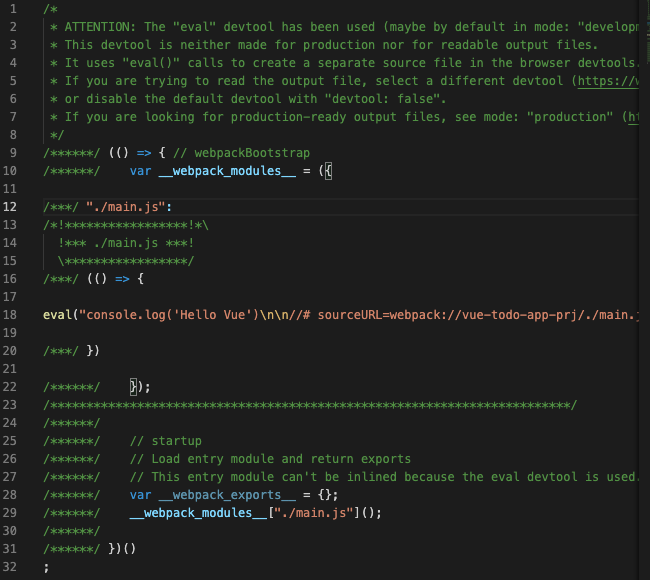

## Vue.js Todo-app Project

<br>

### node 버전 확인
```
$ node -v   // v14.16.1
$ npm -v    // 6.14.12
```

### npm 모듈 설치
* `-y` 옵션은 모듈 설치 시 설정 옵션을 기본 값으로 설정
```
$ npm init -y
```

### npm webpack 설치
* webpack은 웹사이트에서 실행 가능하기 위한 파일들을 만들어 준다.
* `--save-dev`, `-D` : 개발용 의존성 모듈을 지정
* `webpack-cli` : 터미널에서 웹팩 명령(Commands)를 실행할 수 있게 해주는 도구
```
$ npm install webpack --save-dev
또는 
$ npm i -D MODULE_NAME
또는 
$ npm i -D webpack webpack-cli
```

### webpack 설정 파일
webpack.config.js
```js
const path = require('path')

module.exports = {
    mode: 'development',
    entry: {
        app: path.join(__dirname, 'main.js')
    },
    output: {
        filename: '[name].js', // app.js
        path: path.join(__dirname, 'dist')
    },
    module: {},
    plugins: []
}
```
* node.js 런타임 환경에서 실행
* entry (진입점)
    * webpack.config.js 가 실행되면 가장 먼저 살펴보는 부분, 어디 위치로 진입해야하는지 설정
    * `__dirname` : webpack.js.config파일의 위치를 알려주는 node.js 환경 전역변수 

* output
    * 결과물에 대한 설정
    * `[name]` : 진입점의 app이라는 이름이 들어감
    * `dist` : 결과물이 번들되는 디렉토리

### webpack run
```
$ npm run webpack
```




참고 <br>
[Vue 프로젝트 To List 만들기, HEROPY](https://github.com/HeropCode/Vue-Todo-app)

