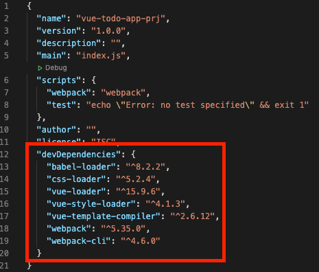

## Vue.js Todo-app Project02

<br>

### Vue-Loader Install 
```
$ npm install -D vue-loader vue-template-compiler
$ npm i -D babel-loader vue-style-loader css-loader
```
* `-D` : 개발용으로 설치
* `vue-loader` : 전체적인 Vue 파일을 해석
* 세부적인 태그 해석을 위한 추가적인 모듈
    * `vue-template-compiler`
    * `babel-loader`
    * `vue-style-loader`
    * `css-loader`


### WebPack Configuration
webpack.config.js
```js
const path = require('path')
const { VueLoaderPlugin } = require('vue-loader')

module.exports = {
    mode: 'development',
    entry: {
        app: path.join(__dirname, 'main.js')
    },
    output: {
        filename: '[name].js', // app.js
        path: path.join(__dirname, 'dist')
    },
    module: {
        rules: [
            {
              test: /\.vue$/,
              loader: 'vue-loader'
            }
          ]
    },
    plugins: [
        new VueLoaderPlugin()
    ]
}
```
* module
    * `.vue` 확장자를 가지고 있는 파일을 vue-loader가 해석 할 수 있도록 설정
    * rules.test : `.vue` 확장자를 찾는 정규표현식
    * loader: `vue-loader` 모듈로 실행
* plugins
    * `require` 통해서 `vue-loader` 모듈을 상수로 선언하여 가져옴


참고 <br>
[Vue 프로젝트 Todo List 만들기, HEROPY](https://github.com/HeropCode/Vue-Todo-app)

