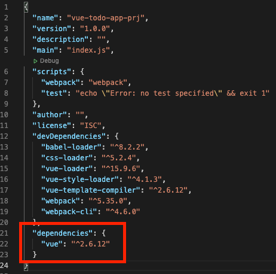

## Vue.js Todo-app Project02 

<br>

### Vue Module Install
```
$ npm i vue
```


### Vue 사용
App.vue
```js
<template>
    <h1> {{ msg }} </h1>
</template>

<script>
export default {
    data () {
        return {
            msg: 'Hello Vue!'
        }
    }
}
</script>

<style>
h1 {
    color: red;
}
</style>
```

main.js
```js
import Vue from 'vue'
import App from './App.vue'

new Vue({
    el: '#app',
    // render (createElement) {
    //     return createElement(App) 
    // },
    render: h => h(App)
})
```
* `vue` 모듈은 **node_modules** 에서 가져와 사용

<br>

### Babel 사용
바벨(Babel)은 ES6 이상의 코드를 ES5 이하 버전으로 변환하기 위해 사용

* babel/core : 바벨이 실제 동작하는 모듈
* babel/preset-env : 바벨의 지원 스펙을 지정
* babel-loader : 웹팩(Webpack)을 지원
* babel/polyfill : 구형 브라우저에서 지원하지 않는 기능들을 지원 (개발버전이 아닌 일반 의존성으로 설치)

<br>

1. **@babel/core @babel/preset-env**

```
$ npm i -D @babel/core @babel/preset-env
```
.babelrc 파일 생성 / 설정
```js
{
    "presets": ["@babel/preset-env"]
}
```

2. **@babel/polyfill**
```
$ npm i @babel/polyfill
```

webpack.config.js
```js
require('@babel/polyfill')

entry: {
        app: [
            '@babel/polyfill',
            path.join(__dirname, 'main.js')
        ]
    },
```
* polyfill 의존을 가져와 **entry**부분 **app**속성에 추가
* `main.js` 보다 먼저 실행 될 수 있게 앞 인덱스에 추가


<br><br><br>참고 <br>
[Vue 프로젝트 Todo List 만들기, HEROPY](https://github.com/HeropCode/Vue-Todo-app)

