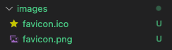

## Vue.js Todo-app Project03 - Plugin Install

<br>

### 이미지 다운로드



<br>

### copy-webpack-plugin 설치/세팅

```
$ npm i -D copy-webpack-plugin
```

webpack.config.js

```js
const CopyPlugin = require('copy-webpack-plugin')

plugins: [
        new VueLoaderPlugin(),
        new HtmlWebpackPlugin({
            template: path.join(__dirname, "index.html")
        }),
        new CopyPlugin({
            patterns: [
                {
                    from: 'images/',
                    to: ''
                }
            ]
        })
    ]
```
* `new CopyPlugin` : 특정 디렉토리나 파일을 copy해서 어딘가에 넣어 줄 수 있는 플러그인
* `from` : copy 대상
* `to` : copy 위치 (**to** 를 빈 칸으로 놓으면 자동으로 `output` 경로로 설정, 일반적으로 빈칸으로 사용)

<br>

### clean-webpack-plugin 설치/세팅

```
$ npm i -D clean-webpack-plugin
```
* `clean-webpack-plugin` : `output` 에 설정한 경로에 해당하는 디렉토리를 빌드 할 때마다 삭제하고 시작

webpack.config.js

```js
const { CleanWebpackPlugin } = require('clean-webpack-plugin')

plugins: [
        new VueLoaderPlugin(),
        new HtmlWebpackPlugin({
            template: path.join(__dirname, "index.html")
        }),
        new CopyPlugin({
            patterns: [
                {
                    from: 'images/',
                    to: ''
                }
            ]
        }),
        new CleanWebpackPlugin()
    ]
```


<br>

### webpack-dev-server 설치/세팅

```
$ npm i -D webpack-dev-server
$ webpack-dev-server --mode development
```

* `webpack-dev-server` 플러그인은 개발 시에 빌드 명령어를 매번 하지 않고도 개발한 내용을 확인 할 수 있도록 도와줌
* `webpack-dev-server --mode development` 명렁어 실행 시 **webpack-dev-server: command not found** 발생은 전체 영역으로 설치 된게 아니고 지역적으로 설치 된거라 직접적인 명령어로는 동작하지 않음

package.json
```js
"scripts": {
    "dev": "webpack-dev-server --mode development",
    "build": "npx webpack --mode production"
}
```

* `"dev": "webpack-dev-server --mode development"` : 지역적으로 실행 할 수 있음

webpack.config.js
```js
devServer: {
    open: false,
    hot: true
},
devtool: 'eval'
```
* `devServer.open` : dev 서버를 실행 할 때 프로젝트를 브라우저에 바로 실행 여부 설정 
* `devServer.hot` : **hot module replacement** 뜻으로 수정사항을 바로 반영이 되어 브라우저에서 확인 할 수 있도록 설정
* `devtool` : 개발용으로 적합한 타임
    * `eval` : 최대한 빠른 빌드 시간으로 반영하여 브라우저에서 확인

<br>

### css 전처리기(sass, PreProcessor)
css가 처리되기 전에 처리되는 개념 <br>
css가 가지고 있지 않은 문법인 연산, 레스팅, statement를 지원 <br>
보통 알고있는 css 보다 고급 문법을 지원 <br>

* sass 설치

```
$ npm i -D sass-loader@^7 node-sass@4.13.0
```

### css 후처리기(PostCSS, AutoPreFixer)

* postCSS 설치

```
$ user$ npm i -D autoprefixer@9.7.3 postcss-loader@3.0.0
```

webpack.config.js
```js
{
    test: /\.css$/,
    use: [
        'vue-style-loader',
        'css-loader',
        'postcss-loader'
    ]
},
{
    test: /\.scss$/,
    use: [
        'vue-style-loader',
        'css-loader',
        'postcss-loader',
        'sass-loader'
    ]
}
```
package.json
```js
"browserslist": [
    "last 2 versions",
    "ie >= 10"
],
```
<br><br><br>참고<br>
[Vue 프로젝트 Todo List 만들기, HEROPY](https://github.com/HeropCode/Vue-Todo-app)

