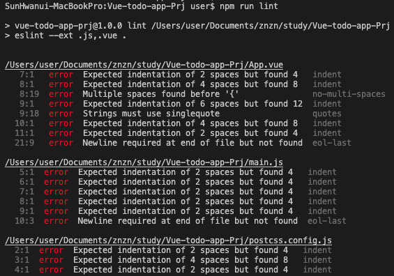
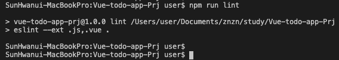

## Vue.js Todo-app Project03 - ESLint

<br>

코드 품질과 코딩 스타일 문제를 식별하기 위한 정적 코드 분석 도구

### ESLint 설치

```
$ npm i -D eslint@^5 babel-eslint eslint-config-standard@^12 eslint-plugin-import eslint-plugin-node eslint-plugin-promise eslint-plugin-standard eslint-plugin-vue
```
package.json
```js
"scripts": {
    "dev": "webpack-dev-server --mode development",
    "build": "npx webpack --mode production",
    "lint": "eslint --ext .js,.vue .",
    "lint:fix": "eslint --fix --ext .js,.vue ."
  },
```
* `lint` : eslint를 이용한 코드 스타일 검증
* `lint:fix` : 스페이스, 괄호 등 기본적인 스타일 검증 실패한 내용을 자동으로 수정

.eslintrc.js
```js
module.exports = {
    root: true,
    parserOptions: {
        parser: 'babel-eslint',
        ecmaVersion: 2015,
        sourceType: 'module'
    },
    env: {
        browser: true,
        node: true
    },
    extends: [
        'standard',
        'plugin:vue/essential'
    ],
    plugins: [
        'vue'
    ],
    rules: {
        'no-new': 0
    }
}
```

.eslintignore
```
node_modules/
dist/
images/
assets/
```

### ESLint 실행 및 코드 스타일 검증
```
$ npm run lint
```



* 검증 후 고쳐야 할 내용이 출력

```
$ npm run lint:fix
$ npm run lint
```



* `lint:fix` 명령어를 이용해 기본적인 에러에 대해 자동 수정
* 자동 수정 후 재 검증 

<br><br><br>참고<br>
[Vue 프로젝트 Todo List 만들기, HEROPY](https://github.com/HeropCode/Vue-Todo-app)

