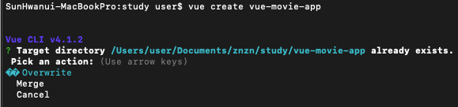
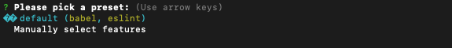
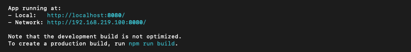
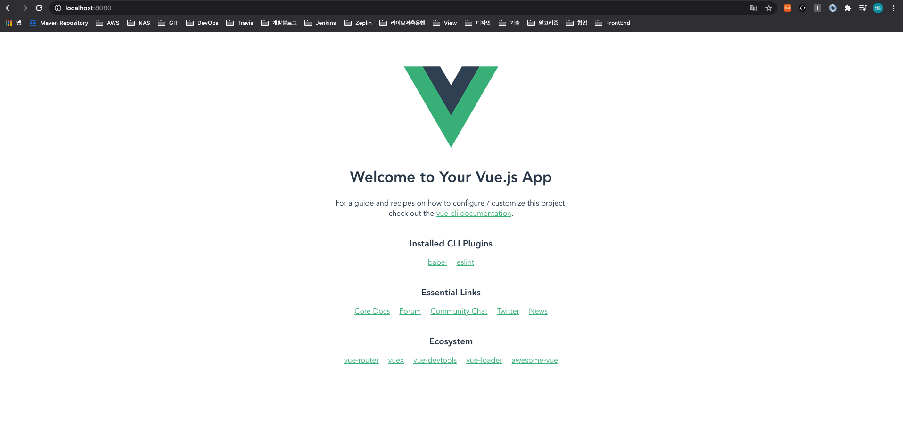
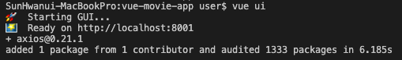
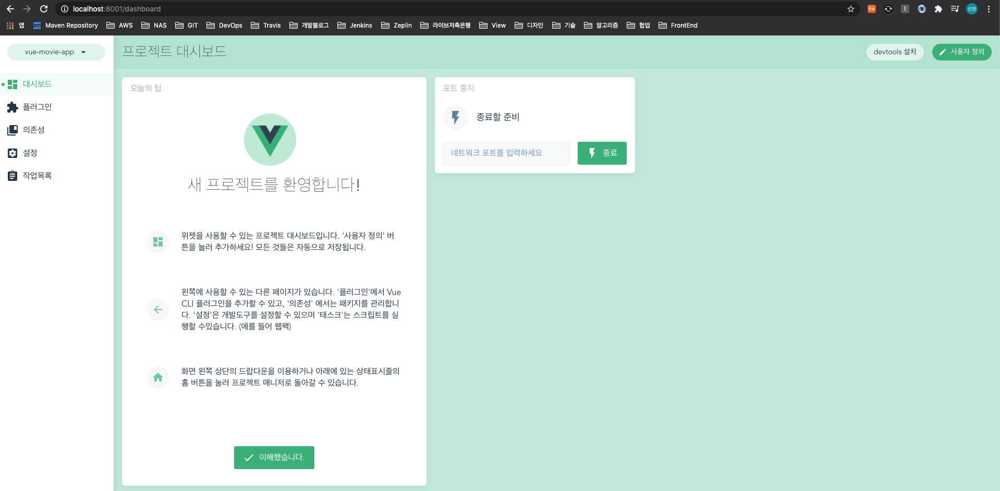

## Vue.js External Install

<br>


### Vue-CLI

Install
```
$ npm install -g @vue/cli
```
* `-g` : 전역(전체) 모드로 설치

Create Project
```
$ vue create vue-movie-app
```


<br>


* default 선택

Run npm
```
$ cd vue-movie-app
$ npm run serve
```

* 로컬 환경으로 실행



<br>

### Vue-UI
* Vue.js 프로젝트 매니저 실행
* 브라우저로 UI 가 제공됨

```
$ vue ui
```


```
http://localhost:8001 // 접속
```



<br><br><br>참고<br>
[Vue 프로젝트 Todo List 만들기, HEROPY](https://github.com/HeropCode/Vue-Todo-app) <br>
[Vue.js org Document](https://router.vuejs.org/kr/guide/essentials/history-mode.html)

